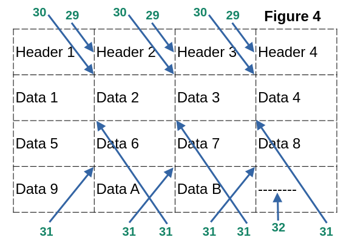
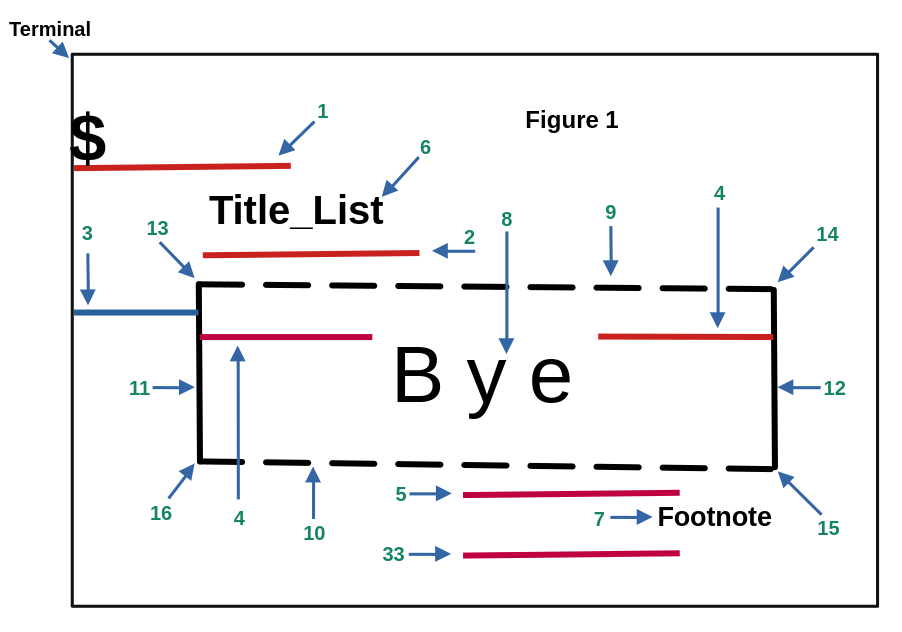
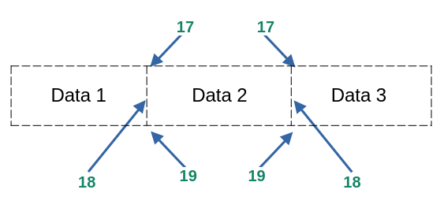
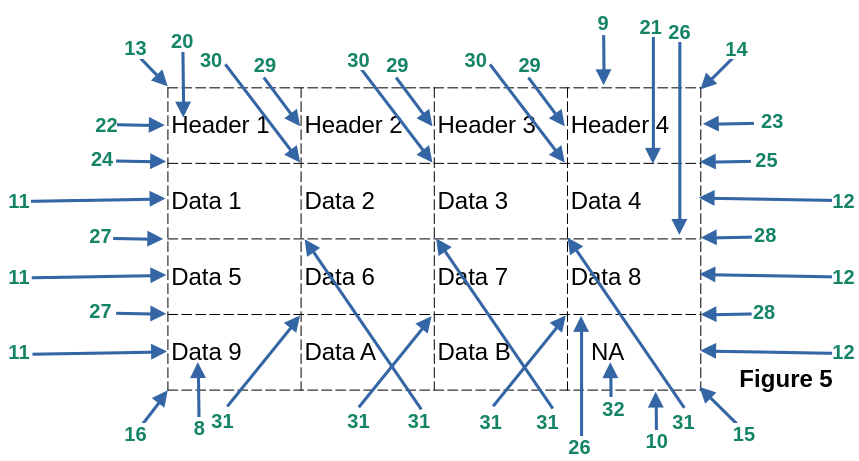

#### [Back](README.md)
# <span style="color:green"> <strong> FancyFormat </strong> </span>
* [**Methods**](#methods)
* [**General Section**](#general-section)
* [**Title Section**](#title-section)
* [**Footnote Section**](#footnote-section)
* [**Data Section**](#data-section)
* [**Horizontal Line Section**](#horizontal-line-section)
* [**Vertical Line Section**](#vertical-line-section)
* [**External Corner Section**](#external-corner-section)
* [**Middle Corner Section**](#middle-corner-section)
* [**Header Section**](#header-section)
* [**Header Under Line Section**](#header-under-line-section)
* [**Sumarize**](#sumarize)
* [**Demo 1**](#example-demo_1)
* [**Demo 2**](#example-demo_2)
* [**Demo 3**](#example-demo_3)
* [**Demo 4**](#example-demo_4)
* [**Demo 5**](#example-demo_5)
* [**Demo 6**](#example-demo_6)

<!-- ---------------------------------- -->
<!-- Methods                            -->
<!-- ---------------------------------- -->
## Methods

This class contains two methods:
+ ***print_fancy_format(data, style)*** <br>
    by default is set up to customized option. This method take two parameters, **data** and **line style**. <br>
    **data:** can be bool, int, float, complex, str, dictionary, range, set, frozenset, or tuple. <br>
    **style:** use the class Line_Style for more option. Check demos for more reference.

+ ***reset_fancy_format()*** <br>
    Any modification on the section variables will be affected on the customized line style. This method will reset all
    section variables to their default values at once.

[**Top**](#fancyformat)

<!-- ---------------------------------- -->
<!-- General Section                    -->
<!-- ---------------------------------- -->
## General Section
**adj → adjust**
    
```python    
    adj_top_margin = 0    adj_bottom_margin = 0    adj_indent = 2    set_fill_chr = "----"
    
    adj_top_space  = 0    adj_bottom_space  = 0    adj_space  = 2    updata_list  = False 

    set_layout     = Layout.HORIZONTAL
```


|                      |                                                                                 |
|----------------------|---------------------------------------------------------------------------------|
| **adj_top_margin**   | Lines to be added between the terminal ($) and the title.                       |
| **adj_top_space**    | Lines to be added between title and top list.                                   |
| **adj_bottom_margin**| Lines to be added between the end of the list or footnote to the terminal ($).  |
| **adj_bottom_space** | Lines to be added between the bottom of the list and the footnote.              |
| **adj_indent**       | Space from the left terminal to the first character in the list to be printed.  | 
| **adj_space**        | Space from the left of the box to the first character in the list to be printed.| 
|                      |                                                                                 |


>  <span style="color:red"> <strong> Note: </strong> </span> These variables only accept int values. 

|             |                                                                                                                           |
|-------------|---------------------------------------------------------------------------------------------------------------------------|
|set_fill_chr | When a list is not complete in the data, it will be filled out with some characters. fill_chr will be converted to string.|
|set_layout   |	This option only works with set, frozenset or range type of variables.                                                    |
|update_list  | update the list being pass as is displayed on the terminal.                                                               |

Notice that every single element in the list being passed will be converted to string in a temporary internal list. 
If you want to save this conversion to your original list then set to True the update_list option. It only works with the list type of variable.

**Note:** adj_top_space won’t work if the title is not set up. Also adj_bottom_space won’t work if the footnote is not set up.
	  Use adj_top_margin or adj_bottom_margin or ins_newline(n), or print(“\n”) if you need more space.

[**Top**](#fancyformat)

<!-- ---------------------------------- -->
<!-- Title Section                      -->
<!-- ---------------------------------- -->
## Title Section

```python
    msg_title	= ""        align_title  = "justify"         hidden_title    = False
    bold_title	= False     italic_title = False             inverse_title    = False
    bg_title	= -1        strike_title = False             blinking_title  = False
    fg_title	= -1        dim_title    = False             underline_title = False
```

**msg_title** is the title name for the list. It only accepts string values, by defaults is empty.

[**Top**](#fancyformat)

<!-- --------------------------------- -->
<!-- Footnote Section                  -->
<!-- --------------------------------- -->
## Footnote Section

```python
    msg_footnote  = ""      align_footnote  = "justify"     hidden_footnote	   = False
    bold_footnote = False   italic_footnote = False         inverse_footnote   = False
    bg_footnote	  = -1      strike_footnote = False         blinking_footnote  = False
    fg_footnote	  = -1      dim_footnote    = False         underline_footnote = False
```

**msg_footnote** The title name for the list. It only accepts string values, by default is empty.

[**Top**](#fancyformat)

<!-- ---------------------------------- -->
<!-- Data Section                       -->
<!-- ---------------------------------- -->
## Data Section

```python
    align_data = "justify"  hidden_data = False            	inverse_data     = False
    bold_data  = False      italic_data = False             blinking_data    = False
    bg_data    = -1         strike_data = False             underline_data   = False
    fg_data    = -1         dim_data    = False             bg_all_cell_data = True
```

**bg_all_cell_data** The bg color will affect the entire cell or just the data.

[**Top**](#fancyformat)

<!-- ---------------------------------- -->
<!-- Horizontal Line Section            -->
<!-- ---------------------------------- -->
## Horizontal Line Section

```python
    top_horizontal_line_chr    = "-"        bottom_horizontal_line_chr ="-"    
    middle_horizontal_line_chr = "-"        top_horizontal_line_on     = True
    bottom_horizontal_line_on  = True       middle_horizontal_line_on  = False
    bold_horizontal_line       = False      bg_horizontal_line         = -1
    fg_horizontal_line         = -1
```
For more reference check **Figure 1**.

[**Top**](#fancyformat)

<!-- ---------------------------------- -->
<!-- Vertical Line Section              -->
<!-- ---------------------------------- -->
## Vertical Line Section

```python
    bold_vertical_line = False              left_vertical_line_chr   = "|"
    bg_vertical_line   = -1                 middle_vertical_line_chr = "|"
    fg_vertical_line   = -1                 right_vertical_line_chr  = "|" 
```    

For more reference check **Figure 1 and Figure 2**.

[**Top**](#fancyformat)

<!-- ---------------------------------- -->
<!-- External Corner Section            -->
<!-- ---------------------------------- -->
## External Corner Section

```python
    top_left_corner_chr  = "+"        bottom_right_corner_chr = "+"       bg_corner_chr = -1
    top_right_corner_chr = "+"        bottom_left_corner_chr  = "+"       fg_corner_chr = -1
	bold_corner_chr      = False
```

For more reference check **Figure 1**.

[**Top**](#fancyformat)


<!-- ---------------------------------- -->
<!-- Middle Corner Section              -->
<!-- ---------------------------------- -->
## Middle Corner Section

```python
    bold_inner_corner_chr = False   middle_top_corner_chr    = "+"      right_lateral_corner_chr	= "+"
    bg_inner_corner_chr	  = -1      middle_inner_corner_chr	 = "+"      left_lateral_corner_chr	= "+"
    fg_inner_corner_chr   = -1      middle_bottom_corner_chr = "+"
```

For reference check **Figure 3 and 4**.

[**Top**](#fancyformat)

<!-- ---------------------------------- -->
<!-- Header Section                     -->
<!-- ---------------------------------- -->
## Header Section

```python
    align_header = "justify"        hidden_header = False               inverse_header   = False
    bold_header = False             italic_header = False               blinking_header  = False
    bg_header   = -1                strike_header = False               underline_header = False
    fg_header   = -1                dim_header    = False               bg_all_cell_ header	= True
```

**bg_all_cell_data** The bg color will affect the entire cell or just the header.

#### <span style="color:blue"> Attributes for the Header Lines</span> 

```python
    bold_vertical_header_line_chr = False       right_vertical_header_line_chr  = "|"
    bg_vertical_header_line_chr   = -1          left_vertical_header_line_chr   = "|"
    fg_vertical_header_line_chr   = -1          middle_vertical_header_line_chr	= "|"
```

For reference check **Figure 3 and 4**.

[**Top**](#fancyformat)


<!-- ---------------------------------- -->
<!-- Header Under Line Section          -->
<!-- ---------------------------------- -->
## Header Under Line Section
#### <span style="color:blue"> Attributes for the line below the header text</span>

```python

    bold_under_line_header = False              horizontal_line_under_header_on	= False
    bg_under_line_header   = -1                 horizontal_line_under_header_chr	= "-" 
    fg_under_line_header   = -1
```    
    horizontal_line_under_header_on	            Horizontal lines between headers and the first data row.


#### <span style="color:blue"> Attributes for the header corners (left, middles and right)</span>

```python

    bold_corner_under_line_header = False       left_corner_line_under_header_chr		= "+"
    bg_corner_under_line_header   = -1          right_corner_line_under_header_chr	= "+"
    fg_corner_under_line_header   = -1          middle_corner_line_under_header_chr	= "+"
```

For more reference check [**figure 3**](#figure-3).

[**Top**](#fancyformat)


<!-- ---------------------------------- -->
<!-- Figure 3 and 4                     -->
<!-- ---------------------------------- -->
## Figure 3

[**Top**](#fancyformat)
## Figure 4

[**Top**](#fancyformat)

# Sumarize
<!-- ---------------------------------- -->
<!-- Sumarize, Figure 1, 2, and 5       -->
<!-- Alignment and Colors Section       -->
<!-- ---------------------------------- -->
**Note:** All the **bg** and **fg** values accept int values from -1 to 256. Default values from the system are -1 and 256. Set the number of the color by name using Use the class Color as shown on Aid class Section.

**Note:** All the **align** options accept 4 values, left (l), justify (j), center (c), and right (r).

<span style="background-color:purple">
<span style="color:yellow"><strong><i>
Note: Although the main idea is to use list type, print_fancy_format(tbl) accepts any type of variable. Refer to Demo 1 and Demo 2. 
</i></strong> </span> </span>

## Figure 1

[**Top**](#fancyformat)
## Figure 2

[**Top**](#fancyformat)
## Figure 5

[**Top**](#fancyformat)

|                                         |                                      |                                          |
|-----------------------------------------|--------------------------------------|------------------------------------------|
| 1.- adj_top_margin                      | 2.- top_space                        | 3.- adj_indent                           |
| 4.- adj_space                           | 5.- bottom_space                     | 6.- msg_title                            |
| 7.- msg_footnote                        | 8.- data                             | 9.- top_horizontal_line_chr              |
| 10.- bottom_horizontal_line_chr         | 11.- left_vertical_line_chr          | 12.- right_vertical_line_chr             |
| 13.- top_left_corner_chr                | 14.- top_right_corner_chr            | 15.- bottom_right_corner_chr             |
| 16.- bottom_left_corner_chr             | 17.- middle_top_corner_chr           | 18.- middle_vertical_line_chr            |
| 19.- middle_bottom_corner_chr           | 20.- header                          | 21.- horizontal_line_under_header_chr    |
| 22.- left_vertical_header_line_chr      | 23.- right_vertical_header_line_chr  | 24.- left_corner_line_under_header_chr   |
| 25.- right_corner_line_under_header_chr | 26.- middle_horizontal_line_chr      | 27.- left_lateral_corner_chr             |
| 28.- right_lateral_corner_chr           | 29.- middle_vertical_header_line_chr | 30.- middle_corner_line_under_header_chr |
| 31.- middle_inner_corner_chr            | 32.- set_fill_chr                    | 33.- adj_bottom_margin                   |
|                                         |                                      |                                          |


***Some Default Values:***
|                                         |                                      |                                          |
|-----------------------------------------|--------------------------------------|------------------------------------------|
|                                         |                                      |                                          |
| top_horizontal_line_on    = 1           | bottom_horizontal_line_on       = 1  |  bg_all_cell_data   = True               |
|                                         |                                      |                                          |
| middle_horizontal_line_on = 0           | horizontal_line_under_header_on	= 0  | bg_all_cell_header = True                |
|                                         |                                      |                                          |
|                                         |                                      |                                          |

***Some Other Default Values:***
|                                         |                                      |                                          |
|-----------------------------------------|--------------------------------------|------------------------------------------|
| align_title = "justify"                 | msg_title = ""                       | align_data   = "justify"		            |
| update_list = False                     | align_footnote = "justify"           | msg_footnote = ""                        |
| align_header = "justify"                | set_layout  = Layout.HORIZONTAL      |                                          | 
|                                         |                                      |                                          |

<!-- ---------------------------------- -->
<!-- Demo 1                             -->
<!-- ---------------------------------- -->

[**Top**](#fancyformat) <span style="color:red"> <strong> Demo 1 </strong> </span>
   
```python
    import custom_print as cp

    list1 = cp.FancyFormat()
    csr   = cp.Cursor()
    draw  = cp.Pen()
    msg   = cp.FancyMessage()

    ncols, nrows = cp.dimensions()
    cp.resize(40, 125)

    lst = [["Header 1","Header 2","Header 3","Header 4"],
           ["R2C1","R2C2","R2C3","R2C4"],
           ["R3C1","R3C2","R3C3","R3C4"],
           ["R3C1","R3C2"]]

    list1.print_fancy_format(lst)

    #-------------------------------------------------------------------------------------
    # int, bool, str, complex, float, range (horizontal and vertical), dictionary       --
    # set (horizontal and vertical), and fronzenset (horizontal and vertical) variables.--
    #-------------------------------------------------------------------------------------
    # SETTINGS FOR THE Fancy_Format Class:

    # general use
    list1.adj_indent = 6
    list1.inverse_data = True
    #list1.update_list = 1

    # title
    list1.bg_title    = 11;         list1.fg_title    = 0
    list1.bold_title  = 1;          list1.align_title = "l"

    # footnote
    list1.align_footnote = "r";     list1.fg_footnote    = 226
    list1.bg_footnote    = 6;       list1.bold_footnote  = 1

    # header
    list1.middle_vertical_header_line_chr = '\u2022'   # matrix list only
    list1.horizontal_line_under_header_on = 1          # horizontal line between headers and the firs data row.
    list1.horizontal_line_under_header_chr = "-"       # chr to be printed for theheader line
    
    list1.bg_header   = 55;     list1.fg_data     = 1
    list1.bold_header = 1;      list1.bg_all_cell_header = False

    print()
    #------------------------------------------------------------------------------------------------------
    # Printing from right to left  <--                                                                   --
    # bool type                                                                                          --
    #------------------------------------------------------------------------------------------------------
    list1.adj_indent = 20;           list1.msg_footnote = " Case 0 "
    list1.msg_title  = " bool ";     my_list0 = True
    list1.print_fancy_format(my_list0)

    # int type
    print(csr.moveTo(6,"up"))
    list1.adj_indent   = 2
    list1.msg_title    = " int "
    list1.msg_footnote = " Case 1 "
    my_list0 = 2547
    list1.print_fancy_format(my_list0)
    cp.ins_newline(2)


    #------------------------------------------------------------------------------------------------------
    # Printing from left to right -->                                                                    --
    # str type                                                                                           --
    #------------------------------------------------------------------------------------------------------
    list1.msg_title    = " str "
    list1.msg_footnote = " Case 4 "
    my_list0 = "Hello There"
    list1.print_fancy_format(my_list0)

    # float type
    print(csr.moveTo(5,"up"),end="")
    list1.adj_indent = 48
    list1.msg_title  = " float "
    list1.msg_footnote = " Case 2 "
    my_list0 = 25.987
    list1.print_fancy_format(my_list0)


    # complex type
    print(csr.moveTo(5,"up"),end="")
    list1.adj_indent  = 25
    list1.msg_title    = " complex "
    list1.msg_footnote = " Case 3 "
    my_list0 = 45.8+698j

    compl = 45.9+25j
    newl = cp.complex2list(compl)
    list1.print_fancy_format(newl)


    # square
    list1.adj_indent = 2
    sp_list = []; n = 0
    while n < 16:
        sp_list.append([cp.ins_chr(85)])
        n += 1


    list1.bg_header    = -1
    list1.fg_data      = -1
    list1.msg_title    = ""
    list1.msg_footnote = ""
    list1.horizontal_line_under_header_on = False
    list1.print_fancy_format(sp_list)
    list1.horizontal_line_under_header_on = True

    list1.adj_indent = 8
    list1.bg_header  = 55
    list1.fg_data    = 1

    list1.blinking_header    = True
    list1.bg_all_cell_header = True

    # range type
    # vertical
    print(csr.moveTo(16,"up"),end="")
    list1.adj_indent = 65
    x = range(0,16,2)
    l = cp.range2list(x,"Header","vertical")
    list1.msg_title      = " Range Data"; list1.msg_footnote =" Case 5 "
    list1.print_fancy_format(l)


    # horizontal
    print(csr.moveTo(14,"up"),end="")
    list1.adj_indent = 8
    x = range(0,16,2)
    list1.msg_title    = " Range Data"
    list1.msg_footnote = " Case 5 "
    list1.print_fancy_format(x)


    # dictionary type
    list1.msg_title    = " Dictionary "
    list1.msg_footnote =" Case 6 "
    dict_tags = {"NAME":"name", "LAST_1":"last_1", "LAST_2":"last_2"}
    cp.terminal_bell()
    list1.print_fancy_format(dict_tags)
    cp.ins_newline(2)

    mensaje = f"{cp.ins_chr(44)}THE END"
    msg.print_fancy_message(mensaje)

    input("Enter to Continue: ")
    cp.resize(nrows, ncols)
```


<!-- ---------------------------------- -->
<!-- Demo 2                             -->
<!-- ---------------------------------- -->
[**Top**](#fancyformat) <span style="color:red"> <strong> Demo 2 </strong> </span>

```python
    import os
    import custom_print as cp

    list1 = cp.FancyFormat()
    csr   = cp.Cursor()
    draw  = cp.Pen()
    msg   = cp.FancyMessage()


    ncols, nrows = cp.dimensions()
    cp.resize(44, 95)

    # setting for the format
    # general use

    list1.adj_indent = 3
    list1.horizontal_line_under_header_on = False
    #list1.update_list = 1
    list1.dim_header = True

    print()

    high = 0
    sp_list = []
    while high < 19:
        sp_list.append([cp.ins_chr(85)])
        high += 1

    # Double Line Square
    list1.bold_title  = True
    list1.bg_title    = 22
    list1.fg_title    = 15
    list1.align_title = "left"
    list1.msg_title   = f"{cp.ins_chr(34)}Nice Double Line Frame{cp.ins_chr(35)}"

    list1.print_fancy_format(sp_list,cp.Line_Style.DOUBLE)

    # title
    list1.bg_title = 11
    list1.fg_title = 21
    list1.bold_title  = 1
    list1.align_title = "l"

    # footnote
    list1.align_footnote = "r"
    list1.fg_footnote    = 226
    list1.bg_footnote    = 6
    list1.bold_footnote  = 1

    # header
    # horizontal line between headers and the firs data row. 1 shows it and 0 hides it
    list1.horizontal_line_under_header_on = 1
    list1.bg_header = 55
    list1.fg_data   = 1

    # set vertical
    print(csr.moveTo(qty=19,direction=cp.Move.UP), end="")
    list1.msg_title    = " Set Data "
    list1.msg_footnote = " Case 7 "
    set_tags = {1,3,5,7,9}
    list1.adj_indent = 70
    new_set = cp.set2list(set_tags, "Header", cp.Layout.VERTICAL)
    list1.print_fancy_format(new_set)


    # Frozenset vertical
    list1.msg_title    = " FrozenSet Data "
    list1.msg_footnote = " Case 8 "
    vowelsT = ("a", "e", "i", "o", "u")
    frozenset_Tuple = frozenset(vowelsT)

    print(csr.moveTo(qty=11,direction=cp.Move.UP), end="")
    list1.adj_indent = 47
    vowellist = cp.set2list(frozenset_Tuple,"header",cp.Layout.VERTICAL)
    list1.print_fancy_format(vowellist)


    # set horizontal
    print(csr.moveTo(qty=11,direction=cp.Move.UP), end="")
    list1.adj_indent   = 6
    list1.msg_title    = " Set Data "
    list1.msg_footnote = " Case 7 "
    list1.print_fancy_format(set_tags)


    # Frozenset horizontal
    list1.inverse_title = True
    list1.msg_title     = " FrozenSet Data "
    list1.msg_footnote  = " Case 8 "
    list1.print_fancy_format(frozenset_Tuple)

    vowellist = cp.set2list(frozenset_Tuple)
    list1.print_fancy_format(vowellist)
    cp.ins_newline(4)

    mensaje = f"{cp.ins_chr(44)}THE END"
    msg.print_fancy_message(mensaje)

    input("Enter to Continue: ")
    cp.resize(nrows, ncols)
```


<!-- ---------------------------------- -->
<!-- Demo 3                             -->
<!-- ---------------------------------- -->
[**Top**](#fancyformat) <span style="color:red"> <strong> Demo 3 </strong> </span>

```python    
    import os
    import custom_print as cp

    list1 = cp.FancyFormat()
    csr   = cp.Cursor()
    draw  = cp.Pen()


    ncols, nrows = cp.dimensions()
    cp.resize(45, 120)


    # setting for the format
    # general use
    list1.bg_all_cell_header = False
    list1.adj_indent = 6
    list1.horizontal_line_under_header_on = False
    #list1.update_list = 1
    list1.bold_header = True
    # list1.inverse_header = True

    print()

    high = 0
    sp_list = []
    while high < 20:
        sp_list.append([cp.ins_chr(95)])
        high += 1

    # single line square
    mymsg = f"{cp.ins_chr(35)}Nice Single Line Frame.{cp.ins_chr(35)}"


    list1.bold_title  = True
    list1.bg_title    = 22
    list1.fg_title    = 15
    list1.align_title = "left"
    list1.msg_title   = f"{cp.ins_chr(39)}Tuple Style Is on \N{FIRE}{cp.ins_chr(40)}" # {"\U0001F525"} fire number
    list1.print_fancy_format(mymsg,cp.Line_Style.SINGLE)

    # Corner Section
    list1.top_left_corner_chr     = '\u250C'          # 13
    list1.top_right_corner_chr    = '\u2510'          # 14
    list1.bottom_right_corner_chr = '\u2518'          # 15
    list1.bottom_left_corner_chr  = '\u2514'          # 16

    # Horizontal Line
    list1.top_horizontal_line_chr    = '\u2500'       # 9
    list1.bottom_horizontal_line_chr = '\u2500'       # 10

    # Vertical Line Selection
    list1.left_vertical_line_chr  = "\u2502"          # 11
    list1.right_vertical_line_chr = "\u2502"          # 12

    # Header Section
    list1.left_vertical_header_line_chr   = "\u2502"  # 22
    list1.right_vertical_header_line_chr  = "\u2502"  # 23


    #list1.print_fancy_format(sp_list)
    print("\n")
    #------------------------------------------------------------------------------------------------
    # The end of the single line square                                                             -
    #------------------------------------------------------------------------------------------------
    # title
    list1.bg_title    = 11
    list1.fg_title    = 0
    list1.bold_title  = 1
    list1.align_title = "l"

    # footnote
    list1.align_footnote = "r"
    list1.fg_footnote    = 226
    list1.bg_footnote    = 6
    list1.bold_footnote  = 1

    # header
    list1.middle_vertical_header_line_chr  = '\u2022' # matrix list only
    list1.horizontal_line_under_header_on  = 1        # horizontal line between headers and the firs data row. 1 shows it and 0 hides it
    list1.horizontal_line_under_header_chr = "-"      # chr to be printed for theheader line
    list1.bg_header = 55
    list1.fg_data   = 1 

    list1.top_left_corner_chr     = "+"            # 13
    list1.top_right_corner_chr    = "+"            # 14
    list1.bottom_right_corner_chr = "+"            # 15
    list1.bottom_left_corner_chr  = "+"            # 16

    list1.top_horizontal_line_chr = "-"            # 9
    list1.bottom_horizontal_line_chr = "-"         # 10
    list1.left_vertical_line_chr  = "|"            # 11
    list1.right_vertical_line_chr = "|"            # 12

    list1.left_vertical_header_line_chr   = "|"    # 22
    list1.right_vertical_header_line_chr  = "|"    # 23


    # Tuples all the cases
        # Case 1, 2, 3
    tupleData1 = ("",)
    tupleData2 = ("Apple",)
    tupleData3 = (("Apple",))

    tupleData4 = (("Header",),("hell",),("hi",),([1,2],)) # this is a simple tuple w/ tuples       Case 4
    tupleData5 = (("Header 0","Header 1"),("hell",),("hi","bye","good"),([1,2],)) #                Case 4
    tupleData6 = ("Header 0","hell","hi",[1,2])             # this is a simple tuple w/ string     Case 5
    tupleData7 = (("Header 0"),("hell"),("hi"),([1,2]))     # this is a simple tuples w/ string    Case 5


    list1.adj_indent   = 8
    list1.msg_title    = " Case 1 "
    list1.msg_footnote = "('',)"
    list1.print_fancy_format(tupleData1)

    csr.jumpTo(5, "up" )
    list1.adj_indent   = 20
    list1.msg_title    = " Case 2 "
    list1.msg_footnote = "('apple',)"
    list1.print_fancy_format(tupleData2)

    csr.jumpTo(5, "up" )
    list1.adj_indent   = 36
    list1.msg_title    = " Case 3 "
    list1.msg_footnote = "(('apple',))"
    list1.print_fancy_format(tupleData2)


    csr.jumpTo(5, "up" )
    list1.adj_indent   = 52
    list1.msg_title    = " Case 4 "
    list1.msg_footnote = " One Col "
    list1.print_fancy_format(tupleData4)


    csr.jumpTo(9, "up" )
    list1.adj_indent   = 69
    list1.msg_title    = " Case 4 "
    list1.msg_footnote = " Tuple Table Type"
    list1.print_fancy_format(tupleData5)

    print()
    list1.adj_indent   = 8
    list1.msg_title    = " Case 5 "
    list1.msg_footnote = " One Row"
    list1.print_fancy_format(tupleData6)

    csr.jumpTo(5, "up" )
    list1.adj_indent   = 52
    list1.msg_title    = " Case 5 "
    list1.msg_footnote = " Tuple Table Type"
    list1.print_fancy_format(tupleData5)
    print()

    # this is a tuple w/ combination other type of variables Case 6
    list1.adj_indent = 52
    list1.msg_title  = " Case 6 "
    tupleData9 = (("hello","hello"),("hell",),("hi","bye","good"),[1,2], "hello")
    list1.msg_footnote = " Vars Combination in a Tuple "
    list1.print_fancy_format(tupleData9)

    msg = f"{cp.ins_chr(44)}THE END.....!{cp.ins_chr(44)}"

    input("Enter to Continue: ")
    cp.resize(nrows, ncols)
```

<!-- ---------------------------------- -->
<!-- Demo 4                             -->
<!-- ---------------------------------- -->
[**Top**](#fancyformat) <span style="color:red"> <strong> Demo 4 </strong> </span>

```python
    import custom_print
    list1 = custom_print.FancyFormat()

    # title
    list1.bg_title    = 11
    list1.fg_title    = 0
    list1.bold_title  = 1
    list1.align_title = "r"
    list1.msg_title   = " Title List "

    # footnote
    list1.align_footnote = "l"
    list1.msg_footnote   = " Footnote "
    list1.fg_footnote    = 226
    list1.bg_footnote    = 6
    list1.bold_footnote  = 1

    list1.horizontal_line_under_header_on = 1
    list1.middle_horizontal_line_on = 1
    list1.bg_header = 6
    list1.fg_header = 0
    list1.bold_header = 1
    list1.align_data = "left"
    list1.bg_data = 55
    list1.fg_data = 256

    list1.adj_top_margin = 2

    my_list = [["Header 1","Header 2","Header 3","Header 4"],["R2C1","R2C2","R2C3","R2C4"],
            ["R3C1","R3C2","R3C3","R3C4"],["R4C1","R4C2","R4C3","R4C4"]]

    list1.print_fancy_format(my_list, custom_print.Line_Style.SINGLE)

    list1.top_horizontal_line_on = 0
    list1.horizontal_line_under_header_on = 0
    list1.middle_horizontal_line_on = 0
    list1.bottom_horizontal_line_on = 0
    list1.print_fancy_format(my_list)
```

<!-- ---------------------------------- -->
<!-- Demo 5                             -->
<!-- ---------------------------------- -->
[**Top**](#fancyformat) <span style="color:red"> <strong> Demo 5 </strong> </span>

```python
    import custom_print as cp
    tbl = cp.FancyFormat()
    tbl.bg_header = 90
    tbl.fg_header = 231

    my_list = [["Header 1","Header 2","Header 3","Header 4"],
               ["Data 1","Data 2","Data 3","Data 4"],
               ["Data 5","Data 6","Data 7","Data 8"],
               ["Data 9","Data A","Data B"]]

    tbl.print_fancy_format(my_list)

    tbl.bg_all_cell_header = False
    tbl.print_fancy_format(my_list)
```


<!-- ---------------------------------- -->
<!-- Demo 6                             -->
<!-- ---------------------------------- -->
[**Top**](#fancyformat) <span style="color:red"> <strong> Demo 6 </strong> </span>

```python
    import custom_print as cp
    tbl = cp.FancyFormat()

    tbl.bg_horizontal_line  = 21;        tbl.bg_header = 90	
    tbl.bg_vertical_line = 21;           tbl.bg_data = 231
    tbl.fg_header = 231;                 tbl.fg_data = 0
    tbl.bold_header = True;              tbl.bold_data = True
    
    tbl.bg_corner_chr = 21;              tbl.bg_inner_corner_chr = 21
    tbl.bg_corner_under_line_header= 21; tbl.middle_horizontal_line_on = True
    tbl.bg_under_line_header= 21;        tbl.bg_vertical_header_line_chr= 21

    tbl.horizontal_line_under_header_on = True

    lst = [["Header 1", "Header 2", "Header 3"],
            ["Data 1",   "Data 2",   "Data 3"  ],
            ["Data 4",   "Data 5",   "Data 6"  ]]

    tbl.print_fancy_format(data=lst, style=cp.Line_Style.SPACE_COL_COLOR)

    tbl.print_fancy_format(data=lst, style=cp.Line_Style.NO_SPACE_COL_COLOR)
```

<span style="background-color:purple">
<span style="color:yellow"><strong><i>
Note: Demo 5 and Demo 6 are more realistic how to use this module. 
</i></strong> </span> </span>

#### [Back](README.md)