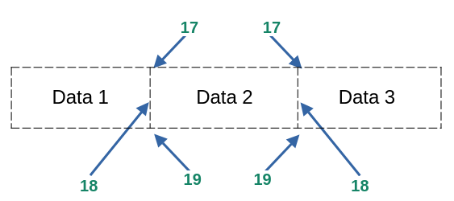
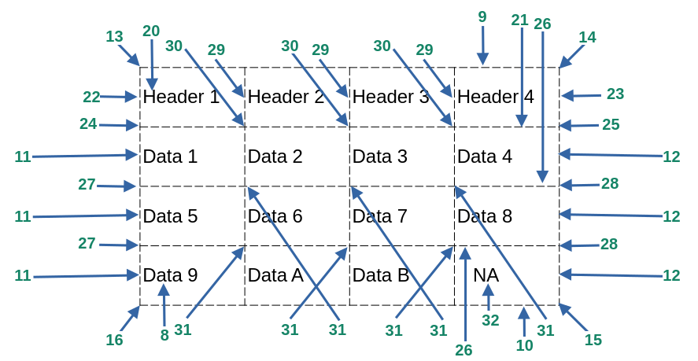

# Custon Print Module

##  <strong> Screen Fucntions </strong> 

### clean()
It cleans the terminal and returns the cursor to home.

### clear()
It clears the terminal and returns the cursor to home.

### erase()
It erases the terminal and leaves the cursor in the current position.

### dimensions()
It returns the dimensions of the terminal, cols and rows.

### resize(row = 25, cols = 80)
It resizes the terminal size.

 <strong> Example: </strong> 
   
    import custom_print as cp
    cp.clean()
    r, c = cp.dimensions()
    print(f"rows: {r}, cols: {c}")
    cp.resize(25, 120)

##  <strong>  Internal Fucntions </strong> 
### bg_ansi_colors(bold = False, fg = -1, n_line = 0)
This function displays all background colors available with ansi code. The following options are for a better visualization.

- The bold option for the font (True/False).
- The fg option to visualize the background colors with a specific foreground color.
- The n_line option to inset lines between the colors. 

 <strong> Example: </strong> 

    import custom_print as cp
    cp.bg_ansi_colors(bold=True, fg=0, n_line=1)

### fg_ansi_colors(bold = False, bg = -1, n_line = 0)
This function displays all the foreground colors available with ansi code. The following options are for a better visualization.
* The bold option for the font (True / False).
* The bg option to visualize the background colors with a specific foreground color.
* The n_line option to insert lines between the colors.

 <strong> Example: </strong> 

    import custom_print as cp
    p.fg_ansi_colors(bold=True, bg=-1, n_line=1)

### ins_chr(n = 1, unicode = " ")
This function inserts n times the unicode provided, by default it is set to space.

 <strong> Example: </strong> 

    import custom_print as cp
    print(f"{cp.ins_chr(n=80, unicode="-")}")
    print(f"{cp.ins_chr(n=80, unicode="\u25B6")}")

### ins_newline(n=1)
This function inserts n new lines.

 <strong> Example: </strong> 

    import custon_print as cp
    print("Hello")
    cp.ins_newline(2)
    print("Bye")

### terminal_bell()
This function makes the sound of the terminal bell.

 <strong> Example: </strong> 

    import custon_print as cp
    input("Press Enter")
    cp.terminal_bell()

### reset_font()
This function resets the font attruibutes when we use the **set_font()** function.

### set_font(bold=False, bg=-1, fg=-1, italic=False, underline=False, strike=False, blinking=False, dim=False, hidden=False, inverse=False)
This function passes many attributes for the font. If passing all these arguments is a little annoying to you, you can use the **Font_Style** Class for simplicity. The best way to use this function is to pass only the first 3 parameters like the example below. 

 <strong> Example: </strong> 

    import custom_print as cp
	print(cp.set_font(1,11,21) + " Python is " + cp.set_font(0,1) + " Wonderful."+cp.reset_font())           
	print(f"{cp.set_font(bold=0, bg=22, fg=0)} Python {cp.set_font(1,90,7)} Language.{cp.reset_font()}")

    Colors range goes from -1 to 256. To set the default color from the system use -1 or 256.

**Note:** These functions are being used by the **FancyFormat** Class. Feel free to ignore them if not useful to you

<strong>
---------------------------------------------------------------------------------------------------------------------
</strong>  

##  <strong> Classes </strong> 

##  <strong> Align </strong> 
    This class is used with the FancyFormat class and FancyMessage class. It contains 4 options.    

- Align.RIGHT
- Align.LEFT
- Align.CENTER
- Align.JUSTIFY

**Note:** These options can be replaced for the original values as displays below:

| Align.RIGHT | Align.LEFT | Align.CENTER | Align.JUSTIFY |
| :---------: | :--------: | :----------: | :-----------: |
| "right"     | "left"     |"center"      | "justify"     |
| "r"         | "l"        |"c"           | "j"           |

##  <strong> Layout </strong> 
    This class is used with FancyFormat class and Pen class. It contains 2 options.

* Layout.HORIZONTAL
* Layout.VERTICAL

**Note:** These options can be replaced for the original values as displays below:

| Layout.HORIZONTAL | Layout.VERTICAL |
| :---------------: | :-------------: |
| "horizontal"      | "vertical"      |
| "h"               | "v"             |

##  <strong> Length_bg </strong> 
    his class is used with FancyMessage class and contains 2 options.
+ ALL_ROW = 1
+ ONLY_WORD = 2

##  <strong> Line_Style </strong> 
	This class is used with FancyFormat class and Pen class. There are some options available.

            CUSTOMIZED          SINGLE          SPACE_COL_COLOR
            SINGLE_BOLD         DASH            NO_SPACE_COL_COLOR
            SINGLE_HEAVY        DOUBLE
            SQR_BRACKETS        NONE

    Note: SPACE_COL_COLOR and NO_SPACE_COL_COLOR are not included in Pen class.

**Note:** These options can be replaced for the original values as displays below:

|                |                      |            |          |                                           |
|----------------|----------------------|------------|----------|-------------------------------------------|
|	CUSTOMIZED   | "customized"         | SINGLE     | "single" | SPACE_COL_COLOR    | "space_col_color"    |
|	SINGLE_BOLD  | single_bold"         | DASH       | "dash"   | NO_SPACE_COL_COLOR | "no_space_col_color" |
|	SINGLE_HEAVY | "single_heavy"       | DOUBLE     | "double" |                    |                      |
|	SQ_BRACKETS  | "sq_brackets"        | NONE       | "none"   |                    |                      |

    Variables to visualize the effect on options SPACE_COL_COLOR and NO_SPACE_COL_COLOR with FancyFormat.

|                         |                                  |                                       |
|-------------------------|----------------------------------|---------------------------------------| 
|bg_horizontal_line  = 21 | bg_header                  = 90  | bg_data = 231                         |
|bg_vertical_line    = 21 | fg_header                  = 231 | fg_data  = 0                          |
|bg_corner_chr       = 21 | bold_header                = True| bold_data = True                      |
|bg_inner_corner_chr = 21 | bg_corner_under_line_header= 21  | middle_horizontal_line_on = True      |
|bg_under_line_header= 21 | bg_vertical_header_line_chr= 21	 | horizontal_line_under_header_on = True|

 <strong> Example: </strong>  Check Demo_6.

##  <strong> Move </strong> 
    This class is uded with the Cursor class and it contains 4 options.

+ Move.RIGHT
+ Move.LEFT
+ Move.UP
+ Move.DOWN

**Note:** These options can be replaced for the original values as displays below:

| Move.RIGHT | Move.LEFT | Move.UP   | Move.DOWN  |
| :--------: | :--------:| :--------:| :--------: |
| "right"    | "left"    |"up"       | "down"     |
| "r"        | "l"       |"u"        | "d"        |

##  <strong> Unicode </strong> 
    This class is to insert some unicode characters.

#### Unicode Names
|Lines and Circles                           | Shapes                       |
|--------------------------------------------|------------------------------|
| BOX_DRAWINGS_LIGHT_HORIZONTAL              | BLACK_UP_POINTING_TRIANGLE   |
| BOX_DRAWINGS_LIGHT_VERTICAL_AND_RIGHT      | WHITE_UP_POINTING_TRIANGLE   |
| BOX_DRAWINGS_LIGHT_VERTICAL_AND_LEFT       | BLACK_RIGHT_POINT_TRIANGLE   |
| BOX_DRAWINGS_LIGHT_VERTICAL                | WHITE_RIGHT_POINT_TRIANGLE   |
| BOX_DRAWINGS_LIGHT_DOWN_AND_HORIZONTAL     | BLACK_DOWN_POINTING_TRIANGLE |
| BOX_DRAWINGS_LIGHT_UP_AND_HORIZONTAL       | WHITE_DOWN_POINTING_TRIANGLE |
| BOX_DRAWINGS_LIGHT_VERTICAL_AND_HORIZONTAL | BLACK_LEFT_POINTING_TRIANGLE |
| EM_DASH                                    | WHITE_LEFT_POINTING_TRIANGLE |
| BLACK_CIRCLE                               | BLACK_DIAMOND                |
| WHITE_CIRCLE                               | WHITE_DIAMOND                |
| FACE                                       | Reference → https://www.unicode.org/charts/nameslist/ |

<strong>
---------------------------------------------------------------------------------------------------------------------
</strong>  

##  <strong> Cursor </strong> 
This class contains 4 methods. The difference between jump and move is that jump executes the code while move returns the code.

+ jumpTo(qty=0, direction=cp.Move.DOWN)&nbsp;	→ This method jumps rows or columns for the cursor in the terminal.
+ jumpxy(x=0, y=0) &nbsp;&nbsp;&nbsp;&nbsp;&nbsp;&nbsp;&nbsp;&nbsp;&nbsp;&nbsp;&nbsp;&nbsp;&nbsp;&nbsp;&nbsp;&nbsp;&nbsp;&nbsp;&nbsp;&nbsp;&nbsp;&nbsp;&nbsp;&nbsp;&nbsp;&nbsp;&nbsp;&nbsp;&nbsp;&nbsp;&nbsp;&nbsp;&nbsp;&nbsp;&nbsp;&nbsp;&nbsp;&nbsp;&nbsp;&nbsp;&nbsp;&nbsp;&nbsp;&nbsp;&nbsp;&nbsp;&nbsp;&nbsp;&nbsp;&nbsp;&nbsp;&nbsp;→ This method jumps the cursor to specific coordinates in the terminal.
+ moveTo(qty=0, direction=cp.Move.DOWN)	→ This method moves rows or columns for the cursor in the terminal.
+ movexy(x=0, y=0) &nbsp;&nbsp;&nbsp;&nbsp;&nbsp;&nbsp;&nbsp;&nbsp;&nbsp;&nbsp;&nbsp;&nbsp;&nbsp;&nbsp;&nbsp;&nbsp;&nbsp;&nbsp;&nbsp;&nbsp;&nbsp;&nbsp;&nbsp;&nbsp;&nbsp;&nbsp;&nbsp;&nbsp;&nbsp;&nbsp;&nbsp;&nbsp;&nbsp;&nbsp;&nbsp;&nbsp;&nbsp;&nbsp;&nbsp;&nbsp;&nbsp;&nbsp;&nbsp;&nbsp;&nbsp;&nbsp;&nbsp;&nbsp;&nbsp;&nbsp; → This method moves the cursor to specific coordinates in the terminal.

 <strong> Example: </strong> 

    from custom_print import Cursor
    from custom_print import clear
    from custom_print import Move
    crs = Cursor()

    clear()
    # jumpTo
    crs.jumpTo(qty=2, direction = Move.DOWN)
    print("I am down")

    crs.jumpTo(qty=20, direction= "right")
    print("I am right")

    crs.jumpTo(1,Move.UP)
    print("I am up")
    crs.jumpTo(5,"down")

    # moveTo
    print(f"{crs.moveTo(15,"right")} First One",  end="")
    print(f"{crs.moveTo(15,"right")} Second One", end="")
    print(f"{crs.moveTo(qty=20,direction="left")}Hello")

    # jumpxy
    crs.jumpxy(0,0)
    print("Start Here*")

    # movexy method
    print(f"{crs.movexy(15,40)}hello again")

    # combination
    crs.jumpTo(8,"down")
    crs.jumpxy(-1,-1)
    print("adios",end="")
    print(f"{crs.moveTo(qty=20,direction=Move.RIGHT)}BYE")

##  <strong> FontStyle </strong> 
This class contains 4 methods and the attributes and their default values are displays below.

+ **style_on() and style_off()** 

    These methods are used if we will be continuing using the style in many rows.

+ **reset_style()** 

    This method will reset the style to the default values.

+ **print_style(msg=message)**

    This method will print the style with the defined attributes.

**Default Values:**

	bg     = -1           hidden   = False        force_align     = False 
    fg     = -1           indent   = 0            blinking        = False
    dim    = False        strike   = False        underline       = False
	bold   = False        italic   = False        bg_top_lines    = 0
    align  = "j"          inverse  = False	      bg_bottom_lines = 0
        	   

	indent → this defines how far we want to start to print the message from the left, it works with style_on and print_style.

	bg_top_lines  and bg_bottom_lines → these are lines above and below the message with the bg specified.

 <strong> Example 1:  style_on() and style_off()  </strong> 

	import custom_print as cp
	fs = cp.FontStyle()
	fs.bg = 21
	fs.fg = 231
	print(f”{fs.style_on()}Font Style Line 1 ”)
	print(f” Font Style Line 2 ”)
	print(f” Font Style Line 3 {fs.style_off()}”)
	fs.reset_style()
	print(f”{fs.style_on()} Default Style {fs.style_off()}”)	

 <strong> Example 2:  print_style(msg)  </strong> 

    import custom_print as cp
    fs = cp.FontStyle()

    fs.fg = 231
    fs.bg = 23
    fs.bold = True
    fs.bg_top_lines = 1
    fs.bg_bottom_lines = 1

    #-------------------------------------------
    msg = f'''
    Full Name Author Here...!
    Align.OPTION
    force_align = False
    Python3.12
    '''

    fs.align = cp.Align.LEFT
    fs.print_style(msg)

    fs.align = cp.Align.CENTER
    fs.print_style(msg)

    fs.align = cp.Align.RIGHT
    fs.print_style(msg)

    fs.align = cp.Align.JUSTIFY
    fs.indent = 7
    fs.print_style(msg)
    cp.ins_newline(2)

    fs.align = "none"
    fs.print_style(msg)
    cp.ins_newline(2)

    #-------------------------------------------
    print(f"{cp.ins_chr(90,"-")}")
    #-------------------------------------------

    msg = f'''
    Full Name Author Here...!
    Align.OPTION
    force_align = True
    Python3.12
    '''

    cp.ins_newline(2)
    fs.force_align = True
    fs.align = cp.Align.LEFT
    fs.print_style(msg)

    fs.align = cp.Align.CENTER
    fs.print_style(msg)

    fs.align = cp.Align.RIGHT
    fs.print_style(msg)

    fs.align = cp.Align.JUSTIFY
    fs.indent = 12
    fs.print_style(msg)

    cp.ins_newline(2)
    fs.align = "none"
    fs.print_style(msg)

 <strong> Example 3:  print_style(msg)  </strong> 

    import custom_print as cp
    fs = cp.FontStyle()
    fs.fg = 231
    fs.bg = 90

    paragraph = '''
	This is the Module Docstrings
	Trailing WhiteSpace refers to any whitespace characters 
	at the end of a line of code or string.
	missing-final-newline refers to set
	the last empty line at the end of the code
	pylint practis.py
	'''

    cp.ins_newline(2)

	fs.align = cp.Align.CENTER
	fs.force_align = False
	fs.bg_top_lines = 1
	fs.bg_bottom_lines = 1
	fs.print_style(paragraph)

	cp.ins_newline(2)

	fs.align = cp.Align.CENTER
	fs.force_align = True
	fs.bg_top_lines = 2
	fst.bg_bottom_lines = 2
	fs.print_style(paragraph)

##  <strong> FancyMessage </strong> 
This class contains 3 methods and the attributes and their default values are displays below.
+ print_fancy_message(msg_body="")

	→ This method works with Body Default Values, Title and Footnote Attributes.

+ print_fancy_note(msg_body="")

	→ This method works with Body Default Values, and Note Default Attributes.

+ get_message_attributes(msg_body="", print_attributes=True)

	→This method returns the attributes of the message in 2 variables. A list with all the attributes of the message and another list with the words of the message. It has the option to print all the attributes at the same time.

**Body Default Values:**

    bg_body     = 4            hidden_body  = False        strike_body    = False			
    fg_body     = 231	       italic_body = False         length         = Length_bg.ALL_ROW 
    dim_body    = False	       left_indent  = 2            inverse_body   = False			
    bold_body   = False        right_indent = 2            blinking_body  = False			
    msg_body    = "Body Msg	   top_lines    = 1            underline_body = False			
    help_lines  = False        bottom_lines = 1

    These two options work when length is Length_bg.ONLY_WORD. They don't do anything when length is Length_bg.All_ROW.

	adj_bg_lines_to_right_indent  = False

	adj_bg_msg_to_space_available = False

    Note: All the above variables are being used by both methods, print_fancy_message and print_fancy_note.

**Note Default Values:**

    msg_note = " Note: "    align_note   = Align.JUSTIFY        blinking_note    = False
    bg_note    = 231        strike_note  = False                underline_note   = False
    fg_note     = 0         italic_note  = False                position_note    = 1 
    bold_note = False       inverse_note = False                right_space_note = 2
    dim_note  = False       hidden_note  = False                left_space_note	 = 2	

**Title Default Values:**

    msg_title  = ""         align_title   = Align.LEFT          blinking_title		= False
    bg_title   = 4          strike_title  = False               underline_title	= False
    fg_title   = 231        italic_title  = False               title_indent		= 2
    bold_title = False      inverse_title = False               lines_title_body	= 1
    dim_title  = False      hidden_title  = False

**Footnote Default Values:**

    msg_footnote  = ""      align_footnote   = Align.RIGHT      blinking_footnote   = False
    bg_footnote   = 4		strike_footnote  = False            underline_footnote  = False
    fg_footnote	  = 231     italic_footnote  = False            footnote_indent     = 2
    bold_footnote = False   inverse_footnote = False            lines_body_footnote = 1
    dim_footnote  = False   hidden_footnote  = False

 <strong> Example 1: </strong> 

    import custom_print as cp
	msg = cp.FancyFormat()

	paragraph = '''
    Guido van Rossum, a Dutch programmer, created Python in the late 1980s
	as a hobby project. He started working on it in December 1989 at Cent-
	rum Wiskunde & Informatica (CWI) in the Netherlands.

    Python was first released on February 20, 1991. Python was named after
	the 1970s BBC comedy sketch series Monty Python's Flying Circus.'''

	msg.msg_title = "TITLE"
	msg.msg_footnote = "FOOTNOTE"

	msg.print_fancy_message(paragraph)		#  Method 1

	cp.ins_newline(2)

	msg.msg_note = “Python”
    msg.position_note = 4
	msg.print_fancy_note(paragraph)			#  Method 2

 <strong> Example 2: </strong> 

    import custom_print as cp
    paragraph3 = '''
    I should probably collect a list of the best
    romantic poems ever written, and maybe I will.
    This is not that. I mostly talk about writing
    books, but I noticed most of the other big
    writing sites actually get most of the their

    traffic from this keyword, because everybody
    is interested in romantic poetry! When you
    want to tell her how you feel, but do not
    have the words to express all that emotion...!
    '''
    fmsg = cp.FancyMessage()                       #  Method 3
    attributes, words = fmsg.get_message_attributes(msg_body=paragraph3, print_attributes=True)

    print(attributes)
    print()
    print(words)

**Note:** *words is a list that contains all the word of the paragraph.*

##  <strong> FancyFormat </strong> 

This class contains two methods: 
											
	print_fancy_format(data, style)	→	Two arguments, the data to print and the line style.
	reset_fancy_format()			→	It resets all the attributes to their default values.

## General Section
**adj → adjust**
    
    
    adj_top_margin = 0    adj_bottom_margin = 0    adj_indent = 2    set_fill_chr = "----"
    
    adj_top_space  = 0    adj_bottom_space  = 0    adj_space  = 2    updata_list  = False 

    set_layout   = Layout.HORIZONTAL

|                  |                                                                                 |
|------------------|---------------------------------------------------------------------------------|
| adj_top_margin   | Lines to be added between the terminal ($) and the title.                       |
| adj_top_space    | Lines to be added between title and top list.                                   |
| adj_bottom_margin| Lines to be added between the end of the list or footnote to the terminal ($).  |
| adj_bottom_space | Lines to be added between the bottom of the list and the footnote.              |
| adj_indent       | Space from the left terminal to the first character in the list to be printed.  | 
| adj_space        | Space from the left of the box to the first character in the list to be printed.| 

**Note** These variables only accept int values.

|             |                                                                                      |
|-------------|--------------------------------------------------------------------------------------|
|set_fill_chr | When a list is not complete in the data, it will be filled out with some characters. fill_chr will be converted to string.|
|set_layout   |	This option only works with set, frozenset or range type of variables.               |
|update_list  | update the list being pass as is displayed on the terminal.                          |

Notice that every single element in the list being passed will be converted to string in a temporary internal list. 
If you want to save this conversion to your original list then set to True the update_list option. It only works with the list type of variable.

Note: adj_top_space won’t work if the title is not set up. Also adj_bottom_space won’t work if the footnote is not set up.
	  Use adj_top_margin or adj_bottom_margin or ins_newline(n), or print(“\n”) if you need more space.

## Title Section
    msg_title	= ""        align_title  = "justify"         hidden_title    = False
    bold_title	= False     italic_title = False             inverse_title    = False
    bg_title	= -1        strike_title = False             blinking_title  = False
    fg_title	= -1        dim_title    = False             underline_title = False

**msg_title** is the title name for the list. It only accepts string values, by defaults is empty.

## Footnote Section
    msg_footnote  = ""      align_footnote  = "justify"     hidden_footnote	   = False
    bold_footnote = False   italic_footnote = False         inverse_footnote   = False
    bg_footnote	  = -1      strike_footnote = False         blinking_footnote  = False
    fg_footnote	  = -1      dim_footnote    = False         underline_footnote = False

**msg_footnote** The title name for the list. It only accepts string values, by default is empty.

## Data Section
    align_data = "justify"  hidden_data = False            	inverse_data     = False
    bold_data  = False      italic_data = False             blinking_data    = False
    bg_data    = -1         strike_data = False             underline_data   = False
    fg_data    = -1         dim_data    = False             bg_all_cell_data = True

**bg_all_cell_data** The bg color will affect the entire cell or just the data.

## Horizontal Line Section
    top_horizontal_line_chr    = "-"        bottom_horizontal_line_chr ="-"    
    middle_horizontal_line_chr = "-"        top_horizontal_line_on     = True
    bottom_horizontal_line_on  = True       middle_horizontal_line_on  = False
    bold_horizontal_line       = False      bg_horizontal_line         = -1
    fg_horizontal_line         = -1

    For more reference check Figure 1.

## Vertical Line Section
    bold_vertical_line = False              left_vertical_line_chr   = "|"
    bg_vertical_line   = -1                 middle_vertical_line_chr = "|"
    fg_vertical_line   = -1                 right_vertical_line_chr  = "|" 
    
    For more reference check Figure 1 and Figure 2.

## External Corner Section
    top_left_corner_chr  = "+"        bottom_right_corner_chr = "+"       bg_corner_chr = -1
    top_right_corner_chr = "+"        bottom_left_corner_chr  = "+"       fg_corner_chr = -1
	bold_corner_chr      = False

    For more reference check Figure 1.

## Middle Corner Section
    bold_inner_corner_chr = False   middle_top_corner_chr    = "+"      right_lateral_corner_chr	= "+"
    bg_inner_corner_chr	  = -1      middle_inner_corner_chr	 = "+"      left_lateral_corner_chr	= "+"
    fg_inner_corner_chr   = -1      middle_bottom_corner_chr = "+"

    For reference check Figure 3 and 4.

## Header Section
    align_header = "justify"        hidden_header = False               inverse_header   = False
    bold_header = False             italic_header = False               blinking_header  = False
    bg_header   = -1                strike_header = False               underline_header = False
    fg_header   = -1                dim_header    = False               bg_all_cell_ header	= True

    bg_all_cell_data	The bg color will affect the entire cell or just the header.

####  Attributes for the Header Lines 
    bold_vertical_header_line_chr = False       right_vertical_header_line_chr  = "|"
    bg_vertical_header_line_chr   = -1          left_vertical_header_line_chr   = "|"
    fg_vertical_header_line_chr   = -1          middle_vertical_header_line_chr	= "|"

    For reference check Figure 3 and 4.

## Header Under Line Section
####  Attributes for the line below the header text
    bold_under_line_header = False              horizontal_line_under_header_on	= False
    bg_under_line_header   = -1                 horizontal_line_under_header_chr	= "-" 
    fg_under_line_header   = -1
    
    horizontal_line_under_header_on	            Horizontal lines between headers and the first data row.

####  Attributes for the header corners (left, middles and right)
    bold_corner_under_line_header = False       left_corner_line_under_header_chr		= "+"
    bg_corner_under_line_header   = -1          right_corner_line_under_header_chr	= "+"
    fg_corner_under_line_header   = -1          middle_corner_line_under_header_chr	= "+"

    For more reference see figure 3.

**Note:** All the **bg** and **fg** values accept int values from -1 to 256. Default values from the system are -1 and 256.

**Note:** All the **align** options accept 4 values, left (l), justify (j), center (c), and right (r).

<strong><i>
Note: Although the main idea is to use list type, print_fancy_format(tbl) accepts any type of variable. Refer to Demo 1 and Demo 2. 
</i></strong>  

# Sumarize

|                                         |                                      |                                          |
|-----------------------------------------|--------------------------------------|------------------------------------------|
| 1.- adj_top_margin                      | 2.- top_space                        | 3.- adj_indent                           |
| 4.- adj_space                           | 5.- bottom_space                     | 6.- msg_title                            |
| 7.- msg_footnote                        | 8.- data                             | 9.- top_horizontal_line_chr              |
| 10.- bottom_horizontal_line_chr         | 11.- left_vertical_line_chr          | 12.- right_vertical_line_chr             |
| 13.- top_left_corner_chr                | 14.- top_right_corner_chr            | 15.- bottom_right_corner_chr             |
| 16.- bottom_left_corner_chr             | 17.- middle_top_corner_chr           | 18.- middle_vertical_line_chr            |
| 19.- middle_bottom_corner_chr           | 20.- header                          | 21.- horizontal_line_under_header_chr    |
| 22.- left_vertical_header_line_chr      | 23.- right_vertical_header_line_chr  | 24.- left_corner_line_under_header_chr   |
| 25.- right_corner_line_under_header_chr | 26.- middle_horizontal_line_chr      | 27.- left_lateral_corner_chr             |
| 28.- right_lateral_corner_chr           | 29.- middle_vertical_header_line_chr | 30.- middle_corner_line_under_header_chr |
| 31.- middle_inner_corner_chr            | 32.- set_fill_chr                    | 33. adj_bottom_margin                    |
|                                         |                                      |                                          |

***Some Default Values:***
|                                         |                                      |                                          |
|-----------------------------------------|--------------------------------------|------------------------------------------|
|                                         |                                      |                                          |
| top_horizontal_line_on    = 1           | bottom_horizontal_line_on       = 1  |  bg_all_cell_data   = True               |
|                                         |                                      |                                          |
| middle_horizontal_line_on = 0           | horizontal_line_under_header_on	= 0  | bg_all_cell_header = True                |
|                                         |                                      |                                          |
|                                         |                                      |                                          |

***Some Other Default Values:***
|                                         |                                      |                                          |
|-----------------------------------------|--------------------------------------|------------------------------------------|
| align_title = "justify"                 | msg_title = ""                       | align_data   = "justify"		            |
| update_list = False                     | align_footnote = "justify"           | msg_footnote = ""                        |
| align_header = "justify"                | set_layout  = Layout.HORIZONTAL      |                                          | 
|                                         |                                      |                                          |

 <strong> Examples: </strong> 

##  <strong>  Example Demo_1 </strong> 
    import custom_print as cp

    list1 = cp.FancyFormat()
    csr   = cp.Cursor()
    draw  = cp.Pen()
    msg   = cp.FancyMessage()

    ncols, nrows = cp.dimensions()
    cp.resize(40, 125)

    lst = [["Header 1","Header 2","Header 3","Header 4"],
           ["R2C1","R2C2","R2C3","R2C4"],
           ["R3C1","R3C2","R3C3","R3C4"],
           ["R3C1","R3C2"]]

    list1.print_fancy_format(lst)

    #-------------------------------------------------------------------------------------
    # int, bool, str, complex, float, range (horizontal and vertical), dictionary       --
    # set (horizontal and vertical), and fronzenset (horizontal and vertical) variables.--
    #-------------------------------------------------------------------------------------
    # SETTINGS FOR THE Fancy_Format Class:

    # general use
    list1.adj_indent = 6
    list1.inverse_data = True
    #list1.update_list = 1

    # title
    list1.bg_title    = 11;         list1.fg_title    = 0
    list1.bold_title  = 1;          list1.align_title = "l"

    # footnote
    list1.align_footnote = "r";     list1.fg_footnote    = 226
    list1.bg_footnote    = 6;       list1.bold_footnote  = 1

    # header
    list1.middle_vertical_header_line_chr = '\u2022'   # matrix list only
    list1.horizontal_line_under_header_on = 1          # horizontal line between headers and the firs data row.
    list1.horizontal_line_under_header_chr = "-"       # chr to be printed for theheader line
    
    list1.bg_header   = 55;     list1.fg_data     = 1
    list1.bold_header = 1;      list1.bg_all_cell_header = False

    print()
    #------------------------------------------------------------------------------------------------------
    # Printing from right to left  <--                                                                   --
    # bool type                                                                                          --
    #------------------------------------------------------------------------------------------------------
    list1.adj_indent = 20;           list1.msg_footnote = " Case 0 "
    list1.msg_title  = " bool ";     my_list0 = True
    list1.print_fancy_format(my_list0)

    # int type
    print(csr.moveTo(6,"up"))
    list1.adj_indent   = 2
    list1.msg_title    = " int "
    list1.msg_footnote = " Case 1 "
    my_list0 = 2547
    list1.print_fancy_format(my_list0)
    cp.ins_newline(2)

    #------------------------------------------------------------------------------------------------------
    # Printing from left to right -->                                                                    --
    # str type                                                                                           --
    #------------------------------------------------------------------------------------------------------
    list1.msg_title    = " str "
    list1.msg_footnote = " Case 4 "
    my_list0 = "Hello There"
    list1.print_fancy_format(my_list0)

    # float type
    print(csr.moveTo(5,"up"),end="")
    list1.adj_indent = 48
    list1.msg_title  = " float "
    list1.msg_footnote = " Case 2 "
    my_list0 = 25.987
    list1.print_fancy_format(my_list0)

    # complex type
    print(csr.moveTo(5,"up"),end="")
    list1.adj_indent  = 25
    list1.msg_title    = " complex "
    list1.msg_footnote = " Case 3 "
    my_list0 = 45.8+698j

    compl = 45.9+25j
    newl = cp.complex2list(compl)
    list1.print_fancy_format(newl)

    # square
    list1.adj_indent = 2
    sp_list = []; n = 0
    while n < 16:
        sp_list.append([cp.ins_chr(85)])
        n += 1

    list1.bg_header    = -1
    list1.fg_data      = -1
    list1.msg_title    = ""
    list1.msg_footnote = ""
    list1.horizontal_line_under_header_on = False
    list1.print_fancy_format(sp_list)
    list1.horizontal_line_under_header_on = True

    list1.adj_indent = 8
    list1.bg_header  = 55
    list1.fg_data    = 1

    list1.blinking_header    = True
    list1.bg_all_cell_header = True

    # range type
    # vertical
    print(csr.moveTo(16,"up"),end="")
    list1.adj_indent = 65
    x = range(0,16,2)
    l = cp.range2list(x,"Header","vertical")
    list1.msg_title      = " Range Data"; list1.msg_footnote =" Case 5 "
    list1.print_fancy_format(l)

    # horizontal
    print(csr.moveTo(14,"up"),end="")
    list1.adj_indent = 8
    x = range(0,16,2)
    list1.msg_title    = " Range Data"
    list1.msg_footnote = " Case 5 "
    list1.print_fancy_format(x)

    # dictionary type
    list1.msg_title    = " Dictionary "
    list1.msg_footnote =" Case 6 "
    dict_tags = {"NAME":"name", "LAST_1":"last_1", "LAST_2":"last_2"}
    cp.terminal_bell()
    list1.print_fancy_format(dict_tags)
    cp.ins_newline(2)

    mensaje = f"{cp.ins_chr(44)}THE END"
    msg.print_fancy_message(mensaje)

    input("Enter to Continue: ")
    cp.resize(nrows, ncols)

##  <strong>  Example Demo_2 </strong> 
    import os
    import custom_print as cp

    list1 = cp.FancyFormat()
    csr   = cp.Cursor()
    draw  = cp.Pen()
    msg   = cp.FancyMessage()

    ncols, nrows = cp.dimensions()
    cp.resize(44, 95)

    # setting for the format
    # general use

    list1.adj_indent = 3
    list1.horizontal_line_under_header_on = False
    #list1.update_list = 1
    list1.dim_header = True

    print()

    high = 0
    sp_list = []
    while high < 19:
        sp_list.append([cp.ins_chr(85)])
        high += 1

    # Double Line Square
    list1.bold_title  = True
    list1.bg_title    = 22
    list1.fg_title    = 15
    list1.align_title = "left"
    list1.msg_title   = f"{cp.ins_chr(34)}Nice Double Line Frame{cp.ins_chr(35)}"

    list1.print_fancy_format(sp_list,cp.Line_Style.DOUBLE)

    # title
    list1.bg_title = 11
    list1.fg_title = 21
    list1.bold_title  = 1
    list1.align_title = "l"

    # footnote
    list1.align_footnote = "r"
    list1.fg_footnote    = 226
    list1.bg_footnote    = 6
    list1.bold_footnote  = 1

    # header
    # horizontal line between headers and the firs data row. 1 shows it and 0 hides it
    list1.horizontal_line_under_header_on = 1
    list1.bg_header = 55
    list1.fg_data   = 1

    # set vertical
    print(csr.moveTo(qty=19,direction=cp.Move.UP), end="")
    list1.msg_title    = " Set Data "
    list1.msg_footnote = " Case 7 "
    set_tags = {1,3,5,7,9}
    list1.adj_indent = 70
    new_set = cp.set2list(set_tags, "Header", cp.Layout.VERTICAL)
    list1.print_fancy_format(new_set)

    # Frozenset vertical
    list1.msg_title    = " FrozenSet Data "
    list1.msg_footnote = " Case 8 "
    vowelsT = ("a", "e", "i", "o", "u")
    frozenset_Tuple = frozenset(vowelsT)

    print(csr.moveTo(qty=11,direction=cp.Move.UP), end="")
    list1.adj_indent = 47
    vowellist = cp.set2list(frozenset_Tuple,"header",cp.Layout.VERTICAL)
    list1.print_fancy_format(vowellist)

    # set horizontal
    print(csr.moveTo(qty=11,direction=cp.Move.UP), end="")
    list1.adj_indent   = 6
    list1.msg_title    = " Set Data "
    list1.msg_footnote = " Case 7 "
    list1.print_fancy_format(set_tags)

    # Frozenset horizontal
    list1.inverse_title = True
    list1.msg_title     = " FrozenSet Data "
    list1.msg_footnote  = " Case 8 "
    list1.print_fancy_format(frozenset_Tuple)

    vowellist = cp.set2list(frozenset_Tuple)
    list1.print_fancy_format(vowellist)
    cp.ins_newline(4)

    mensaje = f"{cp.ins_chr(44)}THE END"
    msg.print_fancy_message(mensaje)

    input("Enter to Continue: ")
    cp.resize(nrows, ncols)

##  <strong>  Example Demo_3 </strong> 
    import os
    import custom_print as cp

    list1 = cp.FancyFormat()
    csr   = cp.Cursor()
    draw  = cp.Pen()

    ncols, nrows = cp.dimensions()
    cp.resize(45, 120)

    # setting for the format
    # general use
    list1.bg_all_cell_header = False
    list1.adj_indent = 6
    list1.horizontal_line_under_header_on = False
    #list1.update_list = 1
    list1.bold_header = True
    # list1.inverse_header = True

    print()

    high = 0
    sp_list = []
    while high < 20:
        sp_list.append([cp.ins_chr(95)])
        high += 1

    # single line square
    mymsg = f"{cp.ins_chr(35)}Nice Single Line Frame.{cp.ins_chr(35)}"

    list1.bold_title  = True
    list1.bg_title    = 22
    list1.fg_title    = 15
    list1.align_title = "left"
    list1.msg_title   = f"{cp.ins_chr(39)}Tuple Style Is on \N{FIRE}{cp.ins_chr(40)}" # {"\U0001F525"} fire number
    list1.print_fancy_format(mymsg,cp.Line_Style.SINGLE)

    # Corner Section
    list1.top_left_corner_chr     = '\u250C'          # 13
    list1.top_right_corner_chr    = '\u2510'          # 14
    list1.bottom_right_corner_chr = '\u2518'          # 15
    list1.bottom_left_corner_chr  = '\u2514'          # 16

    # Horizontal Line
    list1.top_horizontal_line_chr    = '\u2500'       # 9
    list1.bottom_horizontal_line_chr = '\u2500'       # 10

    # Vertical Line Selection
    list1.left_vertical_line_chr  = "\u2502"          # 11
    list1.right_vertical_line_chr = "\u2502"          # 12

    # Header Section
    list1.left_vertical_header_line_chr   = "\u2502"  # 22
    list1.right_vertical_header_line_chr  = "\u2502"  # 23

    #list1.print_fancy_format(sp_list)
    print("\n")
    #------------------------------------------------------------------------------------------------
    # The end of the single line square                                                             -
    #------------------------------------------------------------------------------------------------
    # title
    list1.bg_title    = 11
    list1.fg_title    = 0
    list1.bold_title  = 1
    list1.align_title = "l"

    # footnote
    list1.align_footnote = "r"
    list1.fg_footnote    = 226
    list1.bg_footnote    = 6
    list1.bold_footnote  = 1

    # header
    list1.middle_vertical_header_line_chr  = '\u2022' # matrix list only
    list1.horizontal_line_under_header_on  = 1        # horizontal line between headers and the firs data row. 1 shows it and 0 hides it
    list1.horizontal_line_under_header_chr = "-"      # chr to be printed for theheader line
    list1.bg_header = 55
    list1.fg_data   = 1 

    list1.top_left_corner_chr     = "+"            # 13
    list1.top_right_corner_chr    = "+"            # 14
    list1.bottom_right_corner_chr = "+"            # 15
    list1.bottom_left_corner_chr  = "+"            # 16

    list1.top_horizontal_line_chr = "-"            # 9
    list1.bottom_horizontal_line_chr = "-"         # 10
    list1.left_vertical_line_chr  = "|"            # 11
    list1.right_vertical_line_chr = "|"            # 12

    list1.left_vertical_header_line_chr   = "|"    # 22
    list1.right_vertical_header_line_chr  = "|"    # 23

    # Tuples all the cases
        # Case 1, 2, 3
    tupleData1 = ("",)
    tupleData2 = ("Apple",)
    tupleData3 = (("Apple",))

    tupleData4 = (("Header",),("hell",),("hi",),([1,2],)) # this is a simple tuple w/ tuples       Case 4
    tupleData5 = (("Header 0","Header 1"),("hell",),("hi","bye","good"),([1,2],)) #                Case 4
    tupleData6 = ("Header 0","hell","hi",[1,2])             # this is a simple tuple w/ string     Case 5
    tupleData7 = (("Header 0"),("hell"),("hi"),([1,2]))     # this is a simple tuples w/ string    Case 5

    list1.adj_indent   = 8
    list1.msg_title    = " Case 1 "
    list1.msg_footnote = "('',)"
    list1.print_fancy_format(tupleData1)

    csr.jumpTo(5, "up" )
    list1.adj_indent   = 20
    list1.msg_title    = " Case 2 "
    list1.msg_footnote = "('apple',)"
    list1.print_fancy_format(tupleData2)

    csr.jumpTo(5, "up" )
    list1.adj_indent   = 36
    list1.msg_title    = " Case 3 "
    list1.msg_footnote = "(('apple',))"
    list1.print_fancy_format(tupleData2)

    csr.jumpTo(5, "up" )
    list1.adj_indent   = 52
    list1.msg_title    = " Case 4 "
    list1.msg_footnote = " One Col "
    list1.print_fancy_format(tupleData4)

    csr.jumpTo(9, "up" )
    list1.adj_indent   = 69
    list1.msg_title    = " Case 4 "
    list1.msg_footnote = " Tuple Table Type"
    list1.print_fancy_format(tupleData5)

    print()
    list1.adj_indent   = 8
    list1.msg_title    = " Case 5 "
    list1.msg_footnote = " One Row"
    list1.print_fancy_format(tupleData6)

    csr.jumpTo(5, "up" )
    list1.adj_indent   = 52
    list1.msg_title    = " Case 5 "
    list1.msg_footnote = " Tuple Table Type"
    list1.print_fancy_format(tupleData5)
    print()

    # this is a tuple w/ combination other type of variables Case 6
    list1.adj_indent = 52
    list1.msg_title  = " Case 6 "
    tupleData9 = (("hello","hello"),("hell",),("hi","bye","good"),[1,2], "hello")
    list1.msg_footnote = " Vars Combination in a Tuple "
    list1.print_fancy_format(tupleData9)

    msg = f"{cp.ins_chr(44)}THE END.....!{cp.ins_chr(44)}"

    input("Enter to Continue: ")
    cp.resize(nrows, ncols)

##  <strong>  Example Demo_4 </strong> 
    import custom_print
    list1 = custom_print.FancyFormat()

    # title
    list1.bg_title    = 11
    list1.fg_title    = 0
    list1.bold_title  = 1
    list1.align_title = "r"
    list1.msg_title   = " Title List "

    # footnote
    list1.align_footnote = "l"
    list1.msg_footnote   = " Footnote "
    list1.fg_footnote    = 226
    list1.bg_footnote    = 6
    list1.bold_footnote  = 1

    list1.horizontal_line_under_header_on = 1
    list1.middle_horizontal_line_on = 1
    list1.bg_header = 6
    list1.fg_header = 0
    list1.bold_header = 1
    list1.align_data = "left"
    list1.bg_data = 55
    list1.fg_data = 256

    list1.adj_top_margin = 2

    my_list = [["Header 1","Header 2","Header 3","Header 4"],["R2C1","R2C2","R2C3","R2C4"],
            ["R3C1","R3C2","R3C3","R3C4"],["R4C1","R4C2","R4C3","R4C4"]]

    list1.print_fancy_format(my_list, custom_print.Line_Style.SINGLE)

    list1.top_horizontal_line_on = 0
    list1.horizontal_line_under_header_on = 0
    list1.middle_horizontal_line_on = 0
    list1.bottom_horizontal_line_on = 0
    list1.print_fancy_format(my_list)

##  <strong>  Example Demo_5 </strong> 

    import custom_print as cp
    tbl = cp.FancyFormat()
    tbl.bg_header = 90
    tbl.fg_header = 231

    my_list = [["Header 1","Header 2","Header 3","Header 4"],
               ["Data 1","Data 2","Data 3","Data 4"],
               ["Data 5","Data 6","Data 7","Data 8"],
               ["Data 9","Data A","Data B"]]

    tbl.print_fancy_format(my_list)

    tbl.bg_all_cell_header = False
    tbl.print_fancy_format(my_list)

##  <strong>  Example Demo_6 </strong> 
    import custom_print as cp
    tbl = cp.FancyFormat()

    tbl.bg_horizontal_line  = 21;        tbl.bg_header = 90	
    tbl.bg_vertical_line = 21;           tbl.bg_data = 231
    tbl.fg_header = 231;                 tbl.fg_data = 0
    tbl.bold_header = True;              tbl.bold_data = True
    
    tbl.bg_corner_chr = 21;              tbl.bg_inner_corner_chr = 21
    tbl.bg_corner_under_line_header= 21; tbl.middle_horizontal_line_on = True
    tbl.bg_under_line_header= 21;        tbl.bg_vertical_header_line_chr= 21

    tbl.horizontal_line_under_header_on = True

    lst = [["Header 1", "Header 2", "Header 3"],
            ["Data 1",   "Data 2",   "Data 3"  ],
            ["Data 4",   "Data 5",   "Data 6"  ]]

    tbl.print_fancy_format(data=lst, style=cp.Line_Style.SPACE_COL_COLOR)

    tbl.print_fancy_format(data=lst, style=cp.Line_Style.NO_SPACE_COL_COLOR)

<strong><i>
Note: Demo 5 and Demo 6 are more realistic how to use this module. 
</i></strong>  

##  <strong> Pen </strong> 
	This class contains two methods:

	draw_line(size=0, layout=Layout.HORIZONTAL, tail="\N{BLACK DIAMOND}", body="-", head="\N{BLACK DIAMOND}")

	draw_rectangle(length=3, width=3, style=Line_Style.DASH)

| Rectangle Default Values      |                                   |                                 |
|-------------------------------|-----------------------------------|---------------------------------|
| top_left_corner_chr     = "+"	| top_horizontal_line_chr    = "-"  | right_vertical_line_chr = "|"   |
| top_right_corner_chr    = "+"	| bottom_horizontal_line_chr ="-"   | left_vertical_line_chr  = "|"   |
| bottom_right_corner_chr = "+"	| refill_bg_color = False           |                                 |
| bottom_left_corner_chr  = "+" |                                   |                                 |

| Line Default Values           | General Default Values            |                                 |
|-------------------------------|-----------------------------------|---------------------------------|
|bold_draw_line = False         | adj_indent = 0                    |                                 |
bg_draw_line    = -1			|                                   |                                 |
fg_draw_line    = -1            |                                   |                                 |

 <strong> Example: </strong> 

    import custom_print as cp
    pen = cp.Pen()
    pen.adj_indent = 8
    pen.draw_line(size=20, layout=cp.Layout.HORIZONTAL, tail=cp.Unicode.BLACK_LEFT_POINTING_TRIANGLE,
                  body=cp.Unicode.EM_DASH, head=cp.Unicode.BLAKC_RIGHT_POINT_TRIANGLE)
    cp.ins_newline(2)
    pen.adj_indent = 14
    pen.draw_rectangle(length=8, width=4, style=cp.Line_Style.DOUBLE)

custom_print module is not a big thing, but I hope you find useful occasionally. **Python 3.12.1** or greater is required.						

Note: custom_print module has been tested on RedHat 9, Centos Stream 9, AlmaLinux 9, and Windows 10.

https://github.com/acma82/Custom_Print

## Report bugs at	→	acma.mex@hotmail.com

## 
<strong> Saturday December 8, 2024 </strong>

