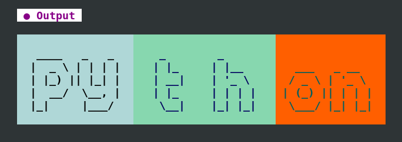
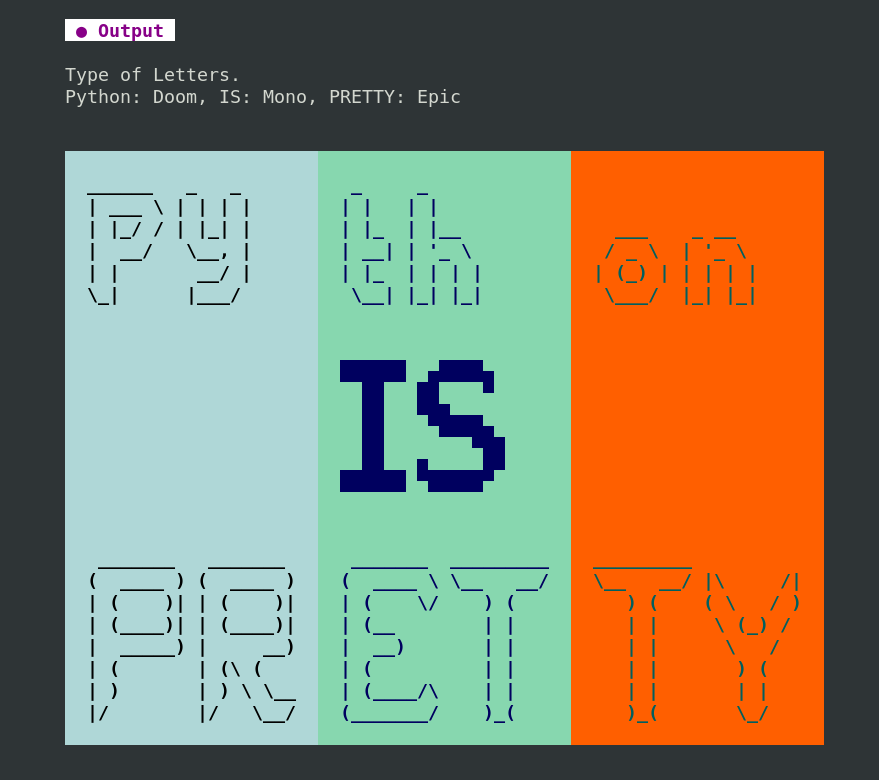
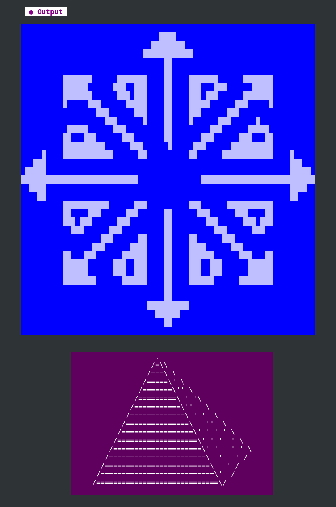
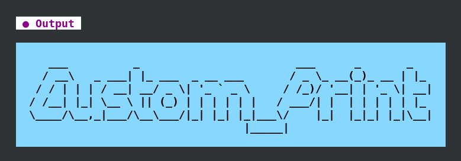

#### [Back](README.md)

# AsciiArt

This class contains 3 [**methods**](#methods) that allow you to print ASCII Art in various styles.


## Methods
* [**print_ascii_art**](#print-ascii-art)
* [**print_multi_ascii_art**](#print_multi_ascii_art)
* [**print_ascii_art_logo**](#print_ascii_art_logo)


The table below describes all the supported names for letters, numbers, and symbols available in the ASciiArt class.

## Description of Ascii Letters Keyboard

      No.    Type           Uppercase    Lowercase    Shiff_On    Shiff_Off      Rows
       1     Alpha             Yes          No           No          No           23    
       2     ANSI_Shadow       Yes          No           Yes         Yes          8     
       3     Big               Yes          Yes          Yes         Yes          8     
       4     Blocks            Yes          No           Yes         Yes          13    
       5     Bulbhead          Yes          No           Yes         Yes          6     
       6     Classy            Yes          Yes          Yes         Yes          8     
       7     Colossal          Yes          Yes          Yes         Yes          10    
       8     Crazy             Yes          Yes          Yes         Yes          15    
       9     Doh               Yes          Yes          Yes         Yes          18    
       10    Doom              Yes          Yes          Yes         Yes          8     
       11    Epic              Yes          No           Yes         Yes          10    
       12    Graceful          Yes          No           Yes         Yes          6     
       13    Larry             Yes          Yes          Yes         Yes          9     
       14    Money_NE          Yes          Yes          Yes         Yes          10    
       15    Money_NW          Yes          Yes          Yes         Yes          10    
       16    Money_SE          Yes          Yes          Yes         Yes          11    
       17    Money_SW          Yes          Yes          Yes         Yes          11    
       18    Mono              Yes          Yes          Yes         Yes          9     
       19    Moon              Yes          No           No          No           5     
       20    Moon2             Yes          No           No          No           5     
       21    Roman             Yes          Yes          Yes         Yes          9     
       22    Standard          Yes          Yes          Yes         Yes          7     
       23    Sweet             No           Yes          Yes         Yes          12    
                                                                                
                                                  Table Ascii Letters Available 

       Rows:  It means the height in rows of the letters for that type.  
       

The table below describes all the supported logos in the AsciiArt class.

        Description of Ascii Logos  


         No.     Name          
                               
         3       Logo_Centos   
         2       Logo_Debian   
         5       Logo_Linux    
         4       Logo_RedHat   
         1       Logo_Unix     
                               
               Logos Available 

       All logos were taking from the following websites below:

      Reference:
        https://www.asciiart.eu/logos
        https://www.asciiart.eu/animations
        https://convertcase.net/bubble-text-generator/
        https://patorjk.com/software/taag/#p=display&f=Isometric2&t

       Note  On  print_ascii_art_logo  will be discuss how to print your own logo.

              

## Default Values

       Default Values 
                                                                                
       Letter Section                                                           
                                                                                
       bg   = -1               |    strike = False                              
       fg   = -1               |    hidden = False                              
       dim  = -1               |    blinking   = False                          
       bold = False            |    underline  = False                          
       italic  = False         |    delay_ms   = 0                              
       inverse = False         |    ascii_type = Ascii_Letter.Standard          
                                                                                

                                                                                
       Space Section           |    Line Section                                
                               |                                                
       adj_indent = 0          |    set_layout = Layout.VERTICAL                
       adj_space  = 0          |    set_top_line_on = True                      
       adj_left_space   = 0    |    set_bottom_line_on = True                   
       adj_middle_space = 0    |                                                
       adj_right_space  = 0    |                                                
                                                                                

      The characters that make up each letter can be modified by changing the
      default values. In addition, every letter includes two extra rows
      (one at the top and one at the bottom). To remove these extra rows,
      set set_top_line_on = False and set_bottom_line_on = False.

      The AsciiArt class supports two printing orientations: HORIZONTAL and
      VERTICAL. To visualize the printing animation, set the delay_ms variable
      to a delay such as 100 ms. If you do not want to see this effect, set
      delay_ms to 0.


## Spacing Parameters

                                                                                
       adj_indent        Left margin from the beginning of the terminal to the  
                         start of the background color.                         
                                                                                
                                                                                
       adj_left_space    Space between the start of the background color and    
                         the first character of the ASCII letter.               
                                                                                
                                                                                
       adj_middle_space  Horizontal spacing between consecutive ASCII art       
                         letters.                                               
                                                                                
                                                                                
       adj_right_space   Space between the last character of the ASCII letter   
                         and the end of the background color.                   
                                                                                

       Note  Unsupported characters for a given ASCII letter type are displayed
             as N/A (Not Applicable). See the Description of Ascii Letters
             Keyboard table for the full list of available characters.


# print ascii art

      The  print_ascii_art()  method converts letters, numbers, and symbols
      into ASCII art. Refer to the Description of Ascii Letters Keyboard table
      for details on which characters are supported by each ASCII letter.

[**Top**](#asciiart) <span style="color:gray"> <strong> Example: </strong> </span>

```python
    import custom_print as cp
    msg = cp.AsciiArt()
    msg.adj_indent = 4

    msg.bold = True
    msg.fg = 231
    msg.bg = 21

    msg.delay_ms = 40
    msg.set_layout = cp.Layout.HORIZONTAL

    msg.print_ascii_art(msg=" Python 3 ")
```    
                                                                     
                   ____   _   _  _    _                      _____   
                  |  _ \ | | | || |_ | |__    ___   _ __    |___ /   
                  | |_) || |_| || __|| '_ \  / _ \ | '_ \     |_ \   
                  |  __/  \__, || |_ | | | || (_) || | | |   ___) |  
                  |_|     |___/  \__||_| |_| \___/ |_| |_|  |____/   
                                                                     

# print_multi_ascii_art
      The print_multi_ascii_art method prints ASCII letters by looping and
      reusing the  print_ascii_art method.  Data is passed as a list in table
      form. The following table describes the required order of parameters
      for this method.

       Order to pass the parameters on this method. 

      0.  Letters        6.  strikes         10. inverse
      1.  Bold           7.  blinking        11. left_space
      2.  bg             8.  dims            12. middle_space
      3.  Fg             9.  hiddends        13. right_space
      4.  italic
      5.  underline


       Variables are NOT being altered by this method. 

      ascii_type         set_top_line_on
      set_layout         set_bottom_line_on
      set_delay_ms

[**Top**](#asciiart) <span style="color:gray"> <strong> Example: </strong> </span>

```python
        import custom_print as cp
        msg = cp.AsciiArt()
        msg.delay_ms = 60
        msg.adj_indent = 6
        msg.set_layout = cp.Layout.HORIZONTAL
        # msg.set_layout = cp.Layout.VERTICAL

        data = [["Py",  "th",  "on" ],    # 0.  Letters
                [True,  True,  True ],    # 1.  Bold
                [152,   115,   202  ],    # 2.  bg
                [16,    17,    23   ],    # 3.  Fg
                [False, False, False],    # 4.  italic
                [False, False, False],    # 5.  underline
                [False, False, False],    # 6.  strikes
                [False, False, False],    # 7.  blinking
                [False, False, False],    # 8.  dims
                [False, False, False],    # 9.  hiddends
                [False, False, False],    # 10. inverse
                [2,     3,     1    ],    # 11. left_space
                [0,     4,     0    ],    # 12. middle_space
                [2,     3,     2    ]]    # 13. right_space

        msg.print_multi_ascii_art(data=data)
```



       Note: All parameters must be provided without skipping any, since the
             number of letter groups the user will use is unknown.
             It is recommended that you experiment with the variables in this
             example to better understand how they work. If you add another
             group of letters, remember to add a corresponding column with the
             styling parameters (such as bgs, fgs, bolds, etc.).


[**Top**](#asciiart) <span style="color:gray"> <strong> Example Combination Of Letters: </strong> </span> 
```python
        import custom_print as cp
        multi_msg = cp.AsciiArt()
        multi_msg.delay_ms = 60
        multi_msg.set_layout = cp.Layout.VERTICAL

        print("    Type of Letters.")
        print("    Python: Doom, IS: Mono, PRETTY: Epic")
        cp.ins_newline(n=2)

        letters = [["Py    ",  "th      ",  "on  " ],
                [f"{cp.ins_chr(n=18)}", "IS    ",
                    f"{cp.ins_chr(n=10)}"],
                ["PR", "ET", "TY"]]

        ascii_type = [cp.Ascii_Letter.DOOM,
                    cp.Ascii_Letter.MONO,
                    cp.Ascii_Letter.EPIC
                    ]

        data =  [[True,  True,  True],         # 1.  Bold
                [152,   115,   202  ],         # 2.  bg
                [16,    17,    23   ],         # 3.  Fg
                [False, False, False],         # 4.  italic
                [False, False, False],         # 5.  underline
                [False, False, False],         # 6.  strikes
                [False, False, False],         # 7.  blinking
                [False, False, False],         # 8.  dims
                [False, False, False],         # 9.  hiddends
                [False, False, False],         # 10. inverse
                [2,     2,     2    ],         # 11. left_space
                [1,     1,     1    ],         # 12. middle_space
                [2,     2,     2    ]]         # 13. right_space


        for l in range(len(letters)):
            data.insert(0, letters[l])
            multi_msg.ascii_type = ascii_type[l]
            multi_msg.print_multi_ascii_art(data=data)
            data.pop(0)
        print()
```



# print_ascii_art_logo
      This method prints an ASCII art logo in the terminal with a chosen
      direction.

       Direction parameter 

      The direction is passed to the method. Four options are available:

                          
       UP_DOWN            
       DOWN_UP            
                          
       RIGHT_LEFT         
       LEFT_RIGHT         
                          

      Custom logos

      The library comes with several predetermined logos. You can also create
      your own logo or custom ASCII letters. Simply pass your logo as a list
      to the ascii_type parameter. See the examples below to learn how to use
      and customize print_ascii_art_logo.


       Note:  This method does NOT use the  set_layout variable. 

[**Top**](#asciiart) <span style="color:gray"> <strong> Example Logo: </strong> </span>

```python
       import custom_print as cp

      logo.bg = 21
      logo.fg = 231
      logo.adj_indent = 5
      logo.ascii_type = cp.Logo_Centos
      logo.print_ascii_art_logo()

      Pyramid = []
      Pyramid.append("                .                       ") # Top()
      Pyramid.append("               /=\\                     ")
      Pyramid.append("              /===\ \                   ")
      Pyramid.append("             /=====\' \                 ")
      Pyramid.append("            /=======\'' \               ")
      Pyramid.append("           /=========\ ' '\             ")
      Pyramid.append("          /===========\''   \           ")
      Pyramid.append("         /=============\ ' '  \         ")
      Pyramid.append("        /===============\   ''  \       ")
      Pyramid.append("       /=================\' ' ' ' \     ")
      Pyramid.append("      /===================\' ' '  ' \   ")
      Pyramid.append("     /=====================\' '   ' ' \ ")
      Pyramid.append("    /=======================\  '   ' /  ")
      Pyramid.append("   /=========================\   ' /    ")
      Pyramid.append("  /===========================\'  /     ")
      Pyramid.append(" /=============================\/       ")
      Pyramid.append("                                        ") # Bottom()
      logo = cp.AsciiArt()
      logo.bg = 53
      logo.fg = 231
      logo.delay_ms = 60
      logo.ascii_type = Pyramid
      logo.adj_indent = 17
      logo.adj_left_space = 4
      logo.adj_right_space = 4

      logo.print_ascii_art_logo(direction=cp.Direction.UP_DOWN)
      # logo.print_ascii_art_logo(direction=cp.Direction.LEFT_RIGHT)
      # logo.print_ascii_art_logo(direction=cp.Direction.RIGHT_LEFT)
      # logo.print_ascii_art_logo(direction=cp.Direction.DOWN_UP)
```



       Desgining your own letter, Ogre: 

      https://patorjk.com/software/taag/#p=display&f=Ogre


[**Top**](#asciiart) <span style="color:gray"> <strong> Example Your Own Logo: </strong> </span>

```python
import custom_print as cp
logo.bg = 21
logo.fg = 231
logo.adj_indent = 4
logo.adj_right_space = 1
logo.adj_left_space = 1
word = []
word.append("                                                                ")
word.append("    ___          _                        ___      _       _    ")
word.append("   / __\   _ ___| |_ ___  _ __ ___       / _ \_ __(_)_ __ | |_  ")
word.append("  / / | | | / __| __/ _ \| '_ ` _ \     / /_)/ '__| | '_ \| __| ")
word.append(" / /__| |_| \__ \ || (_) | | | | | |   / ___/| |  | | | | | |_  ")
word.append(" \____/\__,_|___/\__\___/|_| |_| |_|___\/    |_|  |_|_| |_|\__| ")
word.append("                                  |_____|                       ")
word.append("                                                                ")
logo.ascii_type = hello
logo.print_ascii_art_logo()

```



      In the previous example, users are encouraged to experiment with the
      direction variables to better visualize the logo's behavior.

      Try experimenting with the direction variables in the previous example
      to see how the logo behaves."

      The first logo is a library-predefined logo and the second is
      user-created. The third is a custom letter-based logo, but it is stored
      as a list. The  print_ascii_art  and  print_multi_ascii_art  methods only
      accept strings, so they cannot process this type of data."

      If you want to set colors like the  print_multi_ascii_art method,  you
      must specify the colors when creating the logo as shown in the following
      example. However, be aware that" the  left_right  and  right_left 
      directions will not work correctly, because adding colors breaks the
      column structure. Also  Note  that the  set_layout  and  adj_middle_space 
      vairables are not used by this method.


       Creating your own letters 


                                           
                     ███████ ███    ██  ██  ██  
                     ██      ████   ██  ██▌ ██▌ 
                     ██  ███ ██▌██  ██  ██▌ ██▌ 
                     ██  ▐██ ██▌ ██ ██▌ ██▌ ██▌ 
                     ███████ ██▌  ████▌ ██████▌ 
                      ██ ▐     ▌    █ ▌   ▌   ▌ 
                       ▐            ▌           
                                                

    Find the code of this logo at https://github.com/acma82/Custom_Print/blob/main/8_06_your_own_letters.py

#### [Back](README.md)