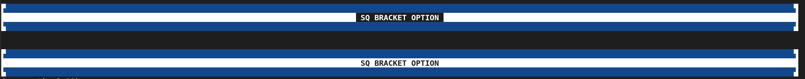

#### [Back](README.md)
# Divider
      The default values are intentionally kept simple. However, you can easily
      modify them to create a more fancy and customized visualization. Several
      ready-to-use templates are also provided for quick and attractive styling.
## Default Variables
```python
#-----------------------------------------------------------------------------------------------------+
#  corner variables                                                                                   |
#-----------------------------------------------------------------------------------------------------+
top_left_corner_chr     = " ";       bg_top_left_corner     = -1;       fg_top_left_corner     = -1
top_right_corner_chr    = " ";       bg_top_right_corner    = -1;       fg_top_right_corner    = -1
bottom_left_corner_chr  = " ";       bg_bottom_left_corner  = -1;       fg_bottom_left_corner  = -1
bottom_right_corner_chr = " ";       bg_bottom_right_corner = -1;       fg_bottom_right_corner = -1

all_corner_chr  = "";                all_bg_corner = -1;                all_fg_corner = -1
all_corner_bold = False

#-----------------------------------------------------------------------------------------------------+
#  Horizontal line Variables                                                                          |
#-----------------------------------------------------------------------------------------------------+
top_horizontal_line_chr    = " ";  bg_top_horizontal_line    = -1;   fg_top_horizontal_line    = -1
bottom_horizontal_line_chr = " ";  bg_bottom_horizontal_line = -1;   fg_bottom_horizontal_line = -1
top_horizontal_line_on     = True; bottom_horizontal_line_on = True; horizontal_line_bold      = False

#-----------------------------------------------------------------------------------------------------+
#  Vertical line Variables                                                                            |
#-----------------------------------------------------------------------------------------------------+
left_vertical_line_chr  = " ";      bg_left_vertical_line  = -1;        fg_left_vertical_line  = -1
right_vertical_line_chr = " ";      bg_right_vertical_line = -1;        fg_right_vertical_line = -1
vertical_line_bold      = False

#-----------------------------------------------------------------------------------------------------+
#  Message Variables                                                                                  |
#-----------------------------------------------------------------------------------------------------+
msg_bold     = False;               msg_bg        = -1;                 msg_fg     = -1
msg_italic   = False;               msg_underline = False;              msg_strike = False
msg_blinking = False;               msg_dim       = False;              msg_hidden = False
msg_inverse  = False;               msg_indent    = 2                   msg_align  = Align.CENTER
# Fill blank
left_fill_bg = -1;                  right_fill_bg = -1;                 left_right_fill_bg = -1
```


       Corner Section

      The  all_corner_*  variables are set to their default values. However,
      if you assign a different value to any  all_corner_*  variable, it takes
      priority over the four individual corner variables.

      For example, setting  all_corner_chr  will apply the same character to all
      four corners:

        top_left_corner_chr         bottom_left_corner_chr
        top_right_corner_chr        bottom_right_corner_chr

       Same apply for all_corner_fg, all_corner_bg, and all_corner_bold.


       Horizontal Line Section

      top_horizontal_line_on and bottom_horizontal_line_on can be off by setting
      them to False.

      horizontal_line_bold: Applies for both, top and bottom lines.

       Vertical Line Section

      vertical_line_bold: Applies for both, left and right lines.

       Fill Section

      Similar to the Corner section, left_fill_bg and right_fill_bg can be
      controlled collectively. Assigning a value to left_right_fill_bg will
      apply the same background color to both the left and right fill areas.


       adj_indent only works when the align is set to JUSTIFY


## Example
```python
import custom_print as cp
'''
    It create a divider through the terminal screen.
'''
cp.ins_newline(1)

div = cp.Divider()


# +--------------------------------------------------------------------------------------------+
# | Divider Settings                                                                           |
# +--------------------------------------------------------------------------------------------+
my_color = cp.No.EARLY_NIGHT_BLUE         # cp.No.INDIGO

div.all_corner_bg = my_color
div.top_horizontal_line_bg    = my_color
div.bottom_horizontal_line_bg = my_color

div.left_vertical_line_bg  = cp.No.WHITE
div.right_vertical_line_bg = cp.No.WHITE

div.all_fill_bg  = cp.No.WHITE

div.msg_align = cp.Align.JUSTIFY
div.adj_indent = 20
div.msg_bold = True


# +--------------------------------------------------------------------------------------------+
# | Printing the Divider                                                                       |
# +--------------------------------------------------------------------------------------------+
div.print_fancy_divider(message=" SQ BRACKET OPTION ", style=cp.Divider_Style.SQ_BRACKETS)

cp.ins_newline(2)
div.msg_bg = 231
div.msg_fg = 234

div.print_fancy_divider(message=" SQ BRACKET OPTION ", style=cp.Divider_Style.SQ_BRACKETS)

```



#### [Back](README.md)