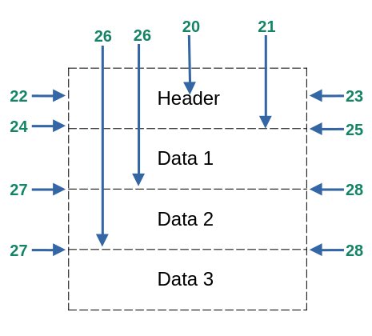
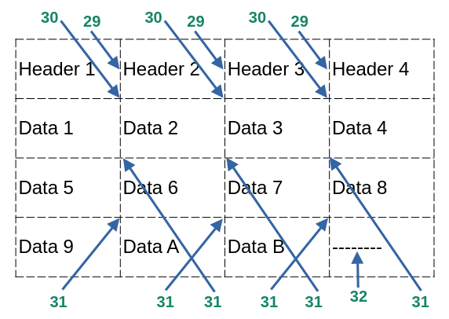
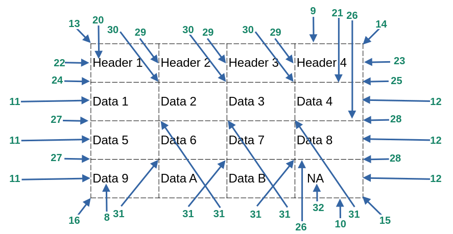
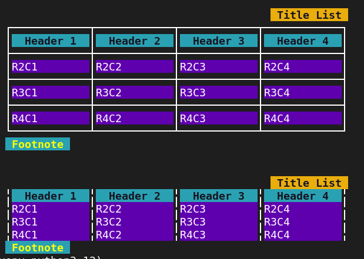

#### [Back](README.md)
# FancyFormat
<!--- # <span style="color:green"> <strong> FancyFormat </strong> </span> --->
* [**General Section**](#general-section)
* [**Title Section**](#title-section)
* [**Footnote Section**](#footnote-section)
* [**Data Section**](#data-section)
* [**Horizontal Line Section**](#horizontal-line-section)
* [**Vertical Line Section**](#vertical-line-section)
* [**External Corner Section**](#external-corner-section)
* [**Middle Corner Section**](#middle-corner-section)
* [**Header Section**](#header-section)
* [**Header Under Line Section**](#header-under-line-section)
* [**Sumarize**](#sumarize)
* [**Demo**](#demo-1)


<!-- ---------------------------------- -->
<!-- Methods                            -->
<!-- ---------------------------------- -->
## Methods
This class contains two methods:
+ ***print_fancy_format(data, style)*** <br>
    by default is set up to customized option. This method take two parameters, **data** and **line style**. <br>
    **data:** can be bool, int, float, complex, str, dictionary, range, set, frozenset, or tuple. <br>
    **style:** use the class Line_Style for more option. Check demos for more reference.

+ ***reset_fancy_format()*** <br>
    Any modification on the section variables will be affected on the customized line style. This method will reset all
    section variables to their default values at once.

<!-- ---------------------------------- -->
<!-- General Section                    -->
<!-- ---------------------------------- -->
## General Section
**adj → adjust**
    
```python    
    adj_top_margin = 0        adj_bottom_margin = 0        adj_indent = 2        set_fill_chr = "----"
    
    adj_top_space  = 0        adj_bottom_space  = 0        adj_space  = 2        updata_list  = False 

    design_color   = 4        bg_line_colors    = -1       fg_line_colors = -1   bold_lines   = False

    set_layout     = Layout.HORIZONTAL

```

|                      |                                                                                 |
|----------------------|---------------------------------------------------------------------------------|
| **adj_top_margin**   | Lines to be added between the terminal ($) and the title.                       |
| **adj_top_space**    | Lines to be added between title and top list.                                   |
| **adj_bottom_margin**| Lines to be added between the end of the list or footnote to the terminal ($).  |
| **adj_bottom_space** | Lines to be added between the bottom of the list and the footnote.              |
| **adj_indent**       | Space from the left terminal to the first character in the list to be printed.  | 
| **adj_space**        | Space from the left of the box to the first character in the list to be printed.| 
| **design_color**     | This color is used for the designs (1 through 10).                              |
| **bg_line_colors**   | Set all the bg_line colors, if it's set to default (-1, 256) then It will be    |
|                      | used the default variables.                                                     |
| **fg_line_colors**   | Set all the fg_line colors, if it's set to default (-1, 256) then It'll be used |
|                      | the default variables.                                                          |
| **bold_lines**       | It will set all the lines to regular and it will respect every single variable  |
|                      | assigned to the bold lines. For True, it will take priority over the others vars| 

>  <span style="color:red"> <strong> Note: </strong> </span> These variables only accept integer(int) values. 

|                 |                                                                                                                           |
|-----------------|---------------------------------------------------------------------------------------------------------------------------|
|**set_fill_chr** | When a list is not complete in the data, it will be filled out with some characters. fill_chr will be converted to string.|
|**set_layout**   |	This option only works with set, frozenset, range or dictionary type of variables.                                        |
|**update_list**  | update the list being pass as is displayed on the terminal.                                                               |

Notice that every single element in the list being passed will be converted to string in a temporary internal list. 
If you want to save this conversion to your original list then set to True the update_list option. It only works with the list type of variable.

**Note:** adj_top_space won’t work if the title is not set up. Also adj_bottom_space won’t work if the footnote is not set up.
	  Use adj_top_margin or adj_bottom_margin or ins_newline(n), or print(“\n”) if you need more space.

[**Top**](#fancyformat)

<!-- ---------------------------------- -->
<!-- Title Section                      -->
<!-- ---------------------------------- -->
## Title Section

```python
    title_msg	= ""        title_align  = "justify"         title_hidden    = False
    title_bold	= False     title_italic = False             title_inverse   = False
    title_bg	= -1        title_strike = False             title_blinking  = False
    title_fg	= -1        title_dim    = False             title_underline = False
```

**title_msg** is the title name for the list. It only accepts string values, by defaults is empty.

<!-- --------------------------------- -->
<!-- Footnote Section                  -->
<!-- --------------------------------- -->
## Footnote Section

```python
    footnote_msg  = ""      footnote_align  = "justify"     footnote_hidden    = False
    footnote_bold = False   footnote_italic = False         footnote_inverse   = False
    footnote_bg	  = -1      footnote_strike = False         footnote_blinking  = False
    footnote_fg	  = -1      footnote_dim    = False         footnote_underline = False
```

**footnote_msg** The title name for the list. It only accepts string values, by default is empty.

<!-- ---------------------------------- -->
<!-- Data Section                       -->
<!-- ---------------------------------- -->
## Data Section

```python
    data_align = "justify"  data_hidden = False             data_inverse     = False
    data_bold  = False      data_italic = False             data_blinking    = False
    data_bg    = -1         data_strike = False             data_underline   = False
    data_fg    = -1         data_dim    = False             data_all_cell_bg = True
```

**data_all_cell_bg** The bg color will affect the entire cell or just the data.

<!-- ---------------------------------- -->
<!-- Horizontal Line Section            -->
<!-- ---------------------------------- -->
## Horizontal Line Section

```python
    top_horizontal_line_chr    = "-"        bottom_horizontal_line_chr ="-"    
    middle_horizontal_line_chr = "-"        top_horizontal_line_on     = True
    bottom_horizontal_line_on  = True       middle_horizontal_line_on  = False
    horizontal_line_bold       = False      horizontal_line_bg         = -1
    horizontal_line_fg         = -1
```
For more reference check **Figure 1**.

[**Top**](#fancyformat)

<!-- ---------------------------------- -->
<!-- Vertical Line Section              -->
<!-- ---------------------------------- -->
## Vertical Line Section

```python
    vertical_line_bold = False              left_vertical_line_chr   = "|"
    vertical_line_bg   = -1                 middle_vertical_line_chr = "|"
    vertical_line_fg   = -1                 right_vertical_line_chr  = "|"
    left_vertical_line_on   = True          right_vertical_line_on   = True
    middle_vertical_line_on = True 
```    

For more reference check **Figure 1 and Figure 2**.

<!-- ---------------------------------- -->
<!-- External Corner Section            -->
<!-- ---------------------------------- -->
## External Corner Section

```python
    top_left_corner_chr  = "+"        bottom_right_corner_chr = "+"       outer_corner_bg = -1
    top_right_corner_chr = "+"        bottom_left_corner_chr  = "+"       outer_corner_fg = -1
    outer_corner_bold = False
```

For more reference check **Figure 1**.

<!-- ---------------------------------- -->
<!-- Middle Corner Section              -->
<!-- ---------------------------------- -->
## Middle Corner Section

```python
    inner_corner_bold_chr = False   middle_top_corner_chr    = "+"      right_lateral_corner_chr = "+"
    inner_corner_bg_chr	  = -1      middle_inner_corner_chr  = "+"      left_lateral_corner_chr  = "+"
    inner_corner_fg_chr   = -1      middle_bottom_corner_chr = "+"
```

For reference check **Figure 3 and 4**.

[**Top**](#fancyformat)

<!-- ---------------------------------- -->
<!-- Header Section                     -->
<!-- ---------------------------------- -->
## Header Section

```python
    header_align = "justify"        header_hidden = False               header_inverse      = False
    header_bold  = False            header_italic = False               header_blinking     = False
    header_bg    = -1               header_strike = False               header_underline    = False
    header_fg    = -1               header_dim    = False               header_all_cell_bg  = True
```

**data_all_cell_bg** The bg color will affect the entire cell or just the header.

#### <span style="color:blue"> Attributes for the Header Lines</span> 

```python
    header_vertical_line_bold_chr = False       header_right_vertical_line_chr  = "|"
    header_vertical_line_bg_chr   = -1          header_left_vertical_line_chr   = "|"
    header_vertical_line_fg_chr   = -1          header_middle_vertical_line_chr	= "|"
```

For reference check **Figure 3 and 4**.

[**Top**](#fancyformat)


<!-- ---------------------------------- -->
<!-- Header Under Line Section          -->
<!-- ---------------------------------- -->
## Header Line Section
#### <span style="color:blue"> Attributes for the line below the header text</span>

```python

    header_horizontal_line_bold = False              header_horizontal_line_on	 = False
    header_horizontal_line_bg   = -1                 header_horizontal_line_chr = "-" 
    header_horizontal_line_fg   = -1
```    
    header_horizontal_line_on	            Horizontal lines between headers and the first data row.


#### <span style="color:blue"> Attributes for the header corners (left, middles and right)</span>

```python

    header_corner_bold = False       header_left_corner_chr   = "+"
    header_corner_bg   = -1          header_right_corner_chr  = "+"
    header_corner_fg   = -1          header_middle_corner_chr = "+"
```

For more reference check [**figure 3**](#figure-3).

[**Top**](#fancyformat)


<!-- ---------------------------------- -->
<!-- Figure 3 and 4                     -->
<!-- ---------------------------------- -->
## Figure 3

[**Top**](#fancyformat)
## Figure 4

[**Top**](#fancyformat)

# Sumarize
<!-- ---------------------------------- -->
<!-- Sumarize, Figure 1, 2, and 5       -->
<!-- Alignment and Colors Section       -->
<!-- ---------------------------------- -->
**Note:** All the **bg** and **fg** values accept int values from -1 to 256. Default values from the system are -1 and 256. Set the number of the color by name using Use the class Color as shown on Aid class Section.

**Note:** All the **align** options accept 4 values, left (l), justify (j), center (c), and right (r).

<span style="background-color:purple">
<span style="color:yellow"><strong><i>
Note: Although the main idea is to use list type, print_fancy_format(tbl) accepts any type of variable. Refer to Demo 1 and Demo 2. 
</i></strong> </span> </span>

## Figure 1

[**Top**](#fancyformat)
## Figure 2

[**Top**](#fancyformat)
## Figure 5

[**Top**](#fancyformat)

|                                         |                                      |                                  |
|-----------------------------------------|--------------------------------------|----------------------------------|
| 1.- adj_top_margin                      | 2.- top_space                        | 3.- adj_indent                   |
| 4.- adj_space                           | 5.- bottom_space                     | 6.- title_msg                    |
| 7.- footnote_msg                        | 8.- data                             | 9.- top_horizontal_line_chr      |
| 10.- bottom_horizontal_line_chr         | 11.- left_vertical_line_chr          | 12.- right_vertical_line_chr     |
| 13.- top_left_corner_chr                | 14.- top_right_corner_chr            | 15.- bottom_right_corner_chr     |
| 16.- bottom_left_corner_chr             | 17.- middle_top_corner_chr           | 18.- middle_vertical_line_chr    |
| 19.- middle_bottom_corner_chr           | 20.- header                          | 21.- header_horizontal_line_chr  |
| 22.- header_left_vertical_line_chr      | 23.- header_right_vertical_line_chr  | 24.- header_left_corner_chr      |
| 25.- header_right_corner_chr            | 26.- middle_horizontal_line_chr      | 27.- left_lateral_corner_chr     |
| 28.- right_lateral_corner_chr           | 29.- header_middle_vertical_line_chr | 30.- header_middle_corner_chr    |
| 31.- middle_inner_corner_chr            | 32.- set_fill_chr                    | 33.- adj_bottom_margin           |
|                                         |                                      |                                  |


***Reference Values:***
|                                      |                                    |                                       |
|--------------------------------------|------------------------------------|---------------------------------------|
|                                      |                                    |                                       |
| top_horizontal_line_on    &rarr; 9   | header_horizontal_line_on &rarr; 21| middle_horizontal_line_on &rarr; 26   |
| bottom_horizontal_line_on &rarr; 10  | left_vertical_line_on &rarr; 11    | right_vertical_line_on &rarr; 12      |
| middle_vertical_line_on &rarr; 18    |                                    |                                       |
|                                      |                                    |                                       |


<!-- ---------------------------------- -->
<!-- Demo 1                             -->
<!-- ---------------------------------- -->

## Demo 
[**Top**](#fancyformat)
   
```python
'''  Demo  '''
import custom_print

list1 = custom_print.FancyFormat()

# title
list1.title_bg    = 11
list1.title_fg    = 0
list1.title_bold  = 1
list1.title_align = "r"
list1.title_msg   = " Title List "

# footnote
list1.footnote_align = "l"
list1.footnote_msg   = " Footnote "
list1.footnote_fg    = 226
list1.footnote_bg    = 6
list1.footnote_bold  = 1

list1.header_horizontal_line_on = 1
list1.middle_horizontal_line_on = 1
list1.header_bg = 6
list1.header_fg = 0
list1.header_bold = 1
list1.data_align = "left"
list1.data_bg = 55
list1.data_fg = 256

list1.adj_top_margin = 2

my_list = [["Header 1","Header 2","Header 3","Header 4"],["R2C1","R2C2","R2C3","R2C4"],
           ["R3C1","R3C2","R3C3","R3C4"],["R4C1","R4C2","R4C3","R4C4"]]

list1.print_fancy_format(my_list, custom_print.Line_Style.SINGLE_LINE)

list1.top_horizontal_line_on = 0
list1.header_horizontal_line_on = 0
list1.middle_horizontal_line_on = 0
list1.bottom_horizontal_line_on = 0
list1.print_fancy_format(my_list)
```




#### [Back](README.md)