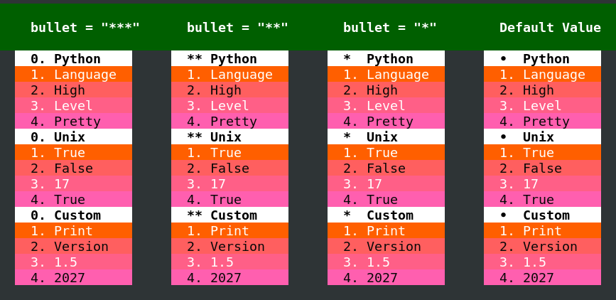
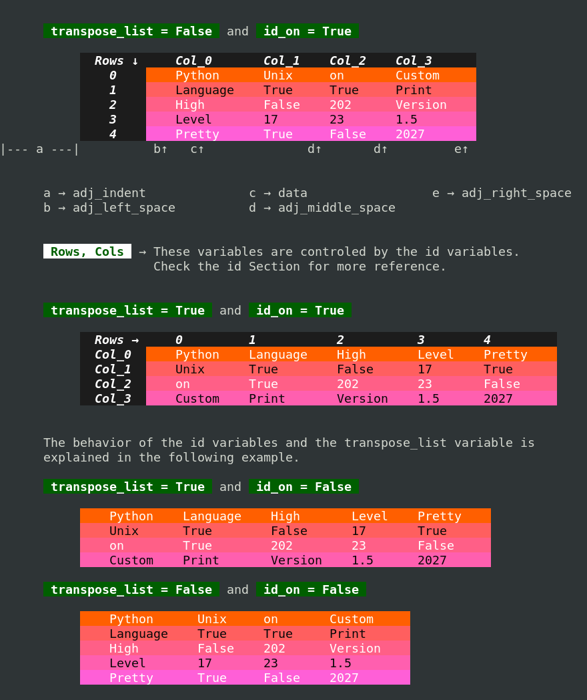
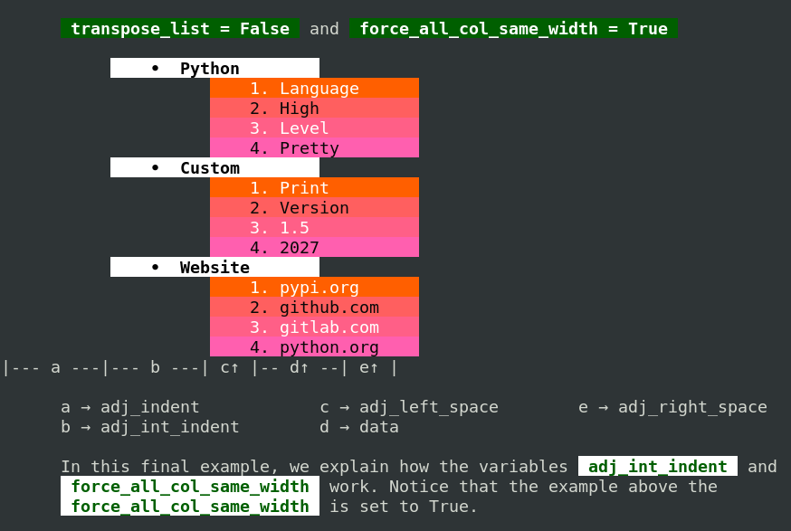
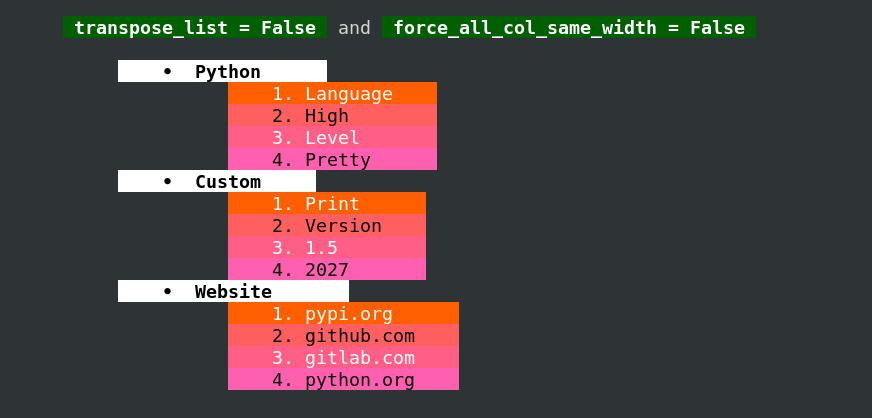
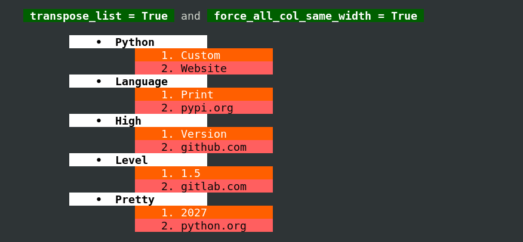
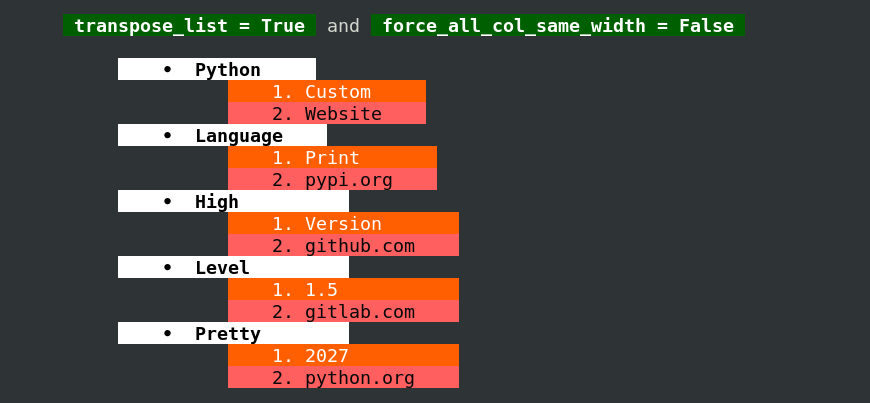

#### [Back](README.md)

# NestedList
      The NestedList class provides two methods for printing nested lists with
      improved visualization. While these methods offer several formatting
      options, users seeking additional styles can also explore the FancyFormat
      class. Please note that these methods share some internal variables for
      convenience."


## Methods
* [**print_nested_list**](#print-nested-list)
* [**print_simple_list**](#print-simple-list)

       Default Values
                                                                           
         print_nested_list         print_simple_list                       
                                                                           
         id Section (Row, Col)     Header Section                          
                                                                           
       • id_on = True            • bullet = "•"                            
       • id_bg = 234             • header_bg = 231                         
       • id_fg = 231             • header_fg = 16                          
       • id_bold = True          • header_bold   = True                    
       • id_dim  = False         • header_dim    = False                   
       • id_italic = True        • header_italic = False                   
       • id_strike = False       • header_strike = False                   
       • id_hidden = False       • header_hidden = False                   
       • id_inverse   = False    • header_inverse   = False                
       • id_blinking  = False    • header_blinking  = False                
       • id_underline = False    • header_underline = False                
                                                                           
       • adj_middle_space = 2    • adj_int_indent = 4                      
                                 • force_all_col_same_width = True         
                                                                           

                                                                           
         Both Methods Share These Variables                                
                                                                           
         Data Section                                                      
                                                                           
       • data_bg = 202           • self.data_bg_step = 1                   
       • data_fg = 231           • self.data_bg_stop = 207                 
       • data_bold   = False     • self.data_fg_step = 1                   
       • data_dim    = False     • self.data_fg_stop = 232                 
       • data_italic = False                                               
       • data_strike = False     • adj_left_space   = 2                    
       • data_hidden = False                                               
       • data_inverse   = False  • adj_right_space  = 2                    
       • data_blinking  = False  • adj_indent       = 2                    
       • data_underline = False  • transpose_list   = False                
                                                                           

       Note 1: Both methods use the same variables for the data section,
               with one exceptions:

               The variable  adj_middle_space  is only used by the
               print_nested_list()  method and is ignored by
               print_simple_list().


               The variables  adj_init_indent  and  force_all_col_same_width 
               only affect the print_simple_list() method and have no effect on
               print_nested_list().

       Note 2: The  bullet  character used in the print_simple_list() method
               (first row or column of this) class can be customized, but it has
               limitations. For instance, you can replace the original  bullet 
               with another character (up to two characters). If you try to use
               three or more characters, the NestedList class will automatically
               replace them with the corresponding numbering (starting at 0.).
               See the example below for the three scenarios.

[**Top**](#nestedlist) <span style="color:gray"> <strong> Example: </strong> </span>



# print nested list
      The example below illustrates how the variables affect the output when
      printing data using this methods. The variables  data_bg_step, 
       data_fg_step, data_bg_start,  and  data_bg_stop  behave exactly the same
      as in the FancyFormat class. Please refer to the documentation of that
      class for details.

[**Top**](#nestedlist) <span style="color:gray"> <strong> Example: </strong> </span>

```python
import custom_print as cp
table = [["Python",    "Unix",   "on" ,    "Custom" ],
        ["Language",  "True",   "True",   "Print"  ],
        ["High",      "False",  "202",    "Version"],
        ["Level",     "17",     "23",     "1.5"    ],
        ["Pretty",    "True",   "False",  "2027"   ]]

nl = cp.NestedList()
nl.print_nested_list(table)
```




# print simple list
    The example below illustrates how the variables affect the output when
    printing data using this methods. The variables  data_bg_step, 
    data_fg_step, data_bg_start,  and  data_bg_stop  behave exactly the same
    as in the FancyFormat class. Please refer to the documentation of that
    class for details.

[**Top**](#nestedlist) <span style="color:gray"> <strong> Example: </strong> </span>

```python
import custom_print as cp
table = [["Python",   "Custom",  "Website"   ],
        ["Language", "Print",   "pypi.org"  ],
        ["High",     "Version", "github.com"],
        ["Level",    "1.5",     "gitlab.com"],
        ["Pretty",   "2027",    "python.org"]]

nl = cp.NestedList()
nl.adj_indent = 11
nl.adj_int_indent = 10
nl.adj_left_space = 4
nl.adj_right_space = 4
nl.print_simple_list(table)

```









#### [Back](README.md)